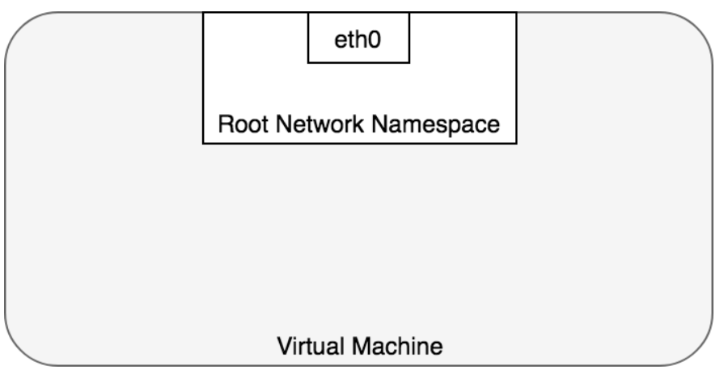
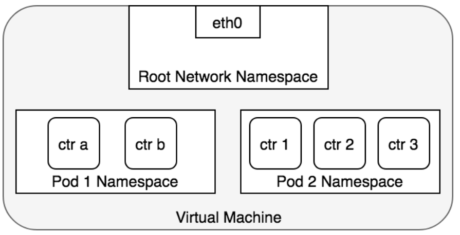
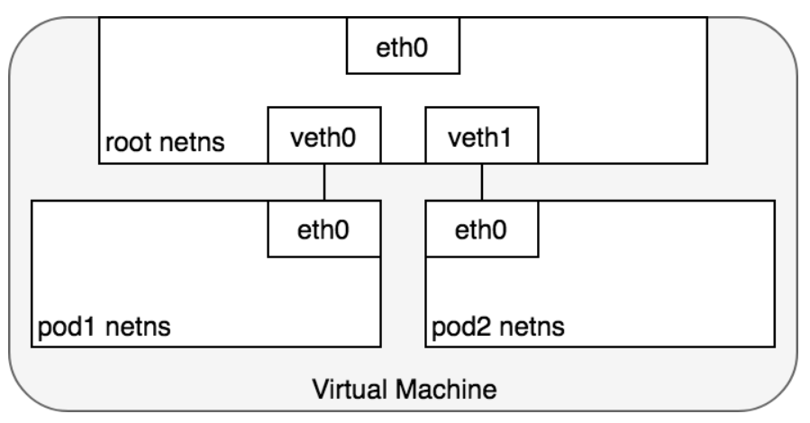
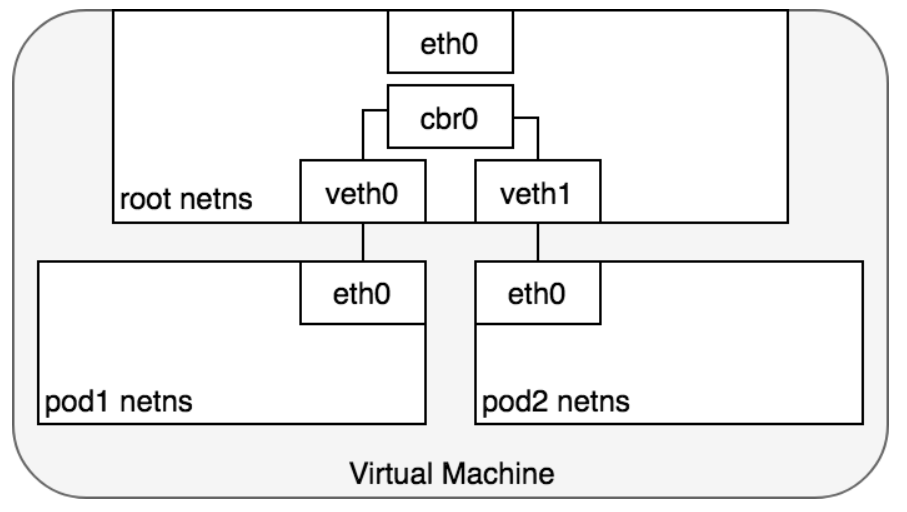

# 基本知识

在 Linux 系统中，每个运行的进程都在一个网络命名空间内进行通信

该命名空间提供了一个逻辑网络协议栈，其中包含自身的路由、防火墙规则和网络设备。

本质上，网络命名空间为命名空间内的所有进程提供了一个全新的网络协议栈。

作为 Linux 用户，可以使用ip命令创建网络命名空间。例如，以下命令将创建一个名为 ip netns add ns1 的新网络命名空间ns1。

创建命名空间时，会创建一个挂载点 /var/run/netns，即使没有进程附加到该命名空间，也能使其持久存在。

可以通过列出所有挂载点来列出可用的命名空间 /var/run/netns，或者使用ip命令。

```sh
$ ls /var/run/netns
ns1

$ ip netns
ns1
```

默认情况下，Linux 将每个进程分配到根网络命名空间，以便访问外部世界



--------------------


在 Docker 架构中，Pod 被建模为一组共享网络命名空间的 Docker 容器。

Pod 内的所有容器都拥有相同的 IP 地址和端口空间，这些地址和端口空间通过分配给 Pod 的网络命名空间分配，并且由于它们位于同一命名空间中，因此可以通过 localhost 相互找到。


我们可以在虚拟机上为每个 Pod 创建一个网络命名空间。该容器会保持网络命名空间的打开状态

而“应用容器”（用户指定的容器）则通过 Docker 的 `--net=container` 参数加入该命名空间。




----------------


在 Kubernetes 中，每个 Pod 都有一个真实的 IP 地址，并且每个 Pod 都使用该 IP 地址与其他 Pod 通信。


我们首先讨论位于同一台机器上的 Pod。

从 Pod 的角度来看，它存在于自己的以太网命名空间中

需要与同一节点上的其他网络命名空间通信？

幸运的是，命名空间可以通过 Linux 虚拟以太网设备 (VEED) 或 veth对 连接 。veth对 由两个虚拟接口组成，可以跨越多个命名空间。


要连接 Pod 的命名空间，我们可以将 veth 对的一端分配给根网络命名空间，另一端分配给 Pod 的网络命名空间。每个 veth 对就像一根网线，连接两端并允许流量在它们之间流动。这种设置可以复制到机器上任意数量的 Pod。





---------------------


此时，我们已经为每个 Pod 设置了各自的网络命名空间，使它们认为自己拥有独立的以太网设备和 IP 地址，并且它们都连接到节点的根命名空间。


现在，我们希望 Pod 通过根命名空间相互通信，为此我们使用网络桥接器。

Linux 以太网桥接器是一种虚拟的二层网络设备，用于连接两个或多个网段，并以透明的方式将两个网络连接在一起。


该桥接器通过维护源地址和目标地址之间的转发表来工作，它会检查流经桥接器的数据包的目标地址，并决定是否将数据包转发到连接到该桥接器的其他网段。桥接代码通过检查网络中每个以太网设备的唯一 MAC 地址来决定是否桥接数据或丢弃数据。

网桥实现 ARP 协议来发现与给定IP地址关联的链路层MAC地址。当网桥收到数据帧时，它会将该帧广播给所有连接的设备（原始发送方除外），并将响应该帧的设备信息存储在查找表中。以后具有相同IP地址的流量会使用该查找表来发现正确的MAC地址，并将数据包转发到该MAC地址。





# K8s对网络的规定

Kubernetes 对 Pod 的联网方式有自己独特的见解。具体来说，Kubernetes 对任何网络实现都规定了以下要求：

1. 所有 Pod 都可以与其他所有 Pod 通信，而无需使用网络地址转换(NAT)。
2. 所有节点都可以与所有 Pod 通信，无需 NAT。
3. Pod 看到的自己的 IP 地址与其他设备看到的 IP 地址相同。


# Pod 到 Pod，同一节点


鉴于网络命名空间将每个 Pod 隔离到各自的网络栈中，虚拟以太网设备将每个命名空间连接到根命名空间，以及连接不同命名空间的网桥，我们终于可以在同一节点上的 Pod 之间发送流量了。


# Pod 到 Pod，跨节点


Kubernetes 的网络模型规定，Pod 必须能够通过其 IP 地址跨节点访问。也就是说，网络中其他 Pod 始终可以看到一个 Pod 的 IP 地址，并且每个 Pod 看到的自己的 IP 地址与其他 Pod 看到的相同。


通常，集群中的每个节点都会被分配一个 CIDR 块，用于指定运行在该节点上的 Pod 可用的 IP 地址。一旦发往该 CIDR 块的流量到达节点，节点就负责将流量转发到正确的 Pod。


目标 Pod（绿色高亮显示）与源 Pod（蓝色高亮显示）位于不同的节点上。


数据包首先通过 Pod 1 的以太网设备发送，该设备与根命名空间中的虚拟以太网设备配对。最终，数据包到达根命名空间的网络桥接器。


由于桥接器上没有连接到具有正确 MAC 地址的设备，ARP 请求将失败。


失败后，桥接器会将数据包通过默认路由——即根命名空间的eth0设备发送出去。


此时，路由离开节点并进入网络。


我们假设网络可以根据分配给节点的 CIDR 块将数据包路由到正确的节点。


数据包进入目标节点（eth0位于 VM 2 上）的根命名空间，并通过桥接器路由到正确的虚拟以太网设备 。


最后，路由通过位于 Pod 4 命名空间内的虚拟以太网设备对完成。一般来说，每个节点都知道如何将数据包分发到其内部运行的 Pod。


数据包到达目标节点后，其流向与同一节点上不同 Pod 之间路由流量相同的方式。


---------------

我们巧妙地避开了如何配置网络以将 Pod IP 的流量路由到负责这些 IP 的正确节点这一问题。这属于网络特定范畴，但查看具体示例将有助于深入了解相关问题。


例如，在 AWS 中，亚马逊维护了一个用于 Kubernetes 的容器网络插件，该插件允许使用容器网络接口 (CNI) 插件在 Amazon VPC 环境中实现节点到节点的网络通信。

容器网络接口 (CNI) 提供了一个通用的 API，用于将容器连接到外部网络。


部署 Pod 时，一个作为 DaemonSet 部署到 Kubernetes 集群的小型二进制文件会接收来自节点本地kubelet进程的任何将 Pod 添加到网络的请求。


该二进制文件从节点的可用以太网接口池中选择一个可用的 IP 地址，并通过在 Linux 内核中配置虚拟以太网设备和网桥，将其分配给 Pod，具体操作方式与在同一节点内配置 Pod 时所述相同。完成此操作后，Pod 流量即可在集群内的不同节点之间路由。

