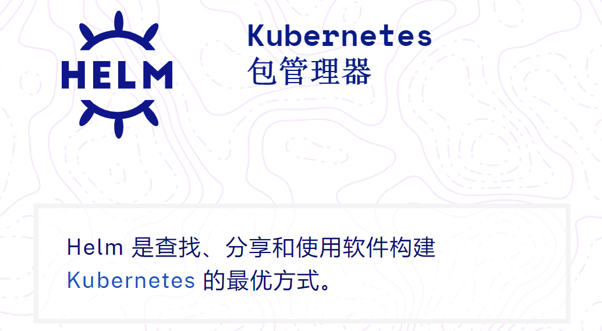
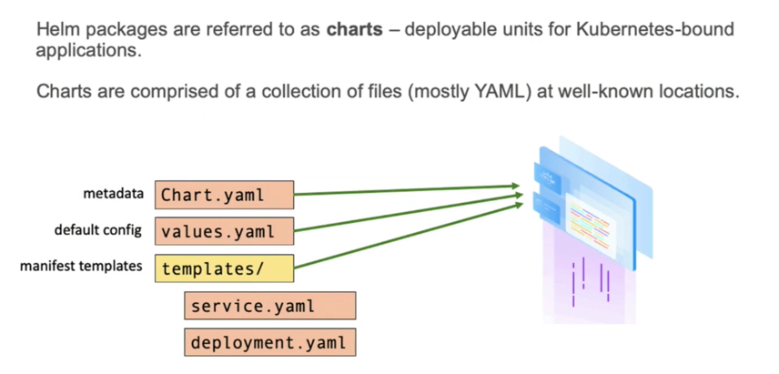
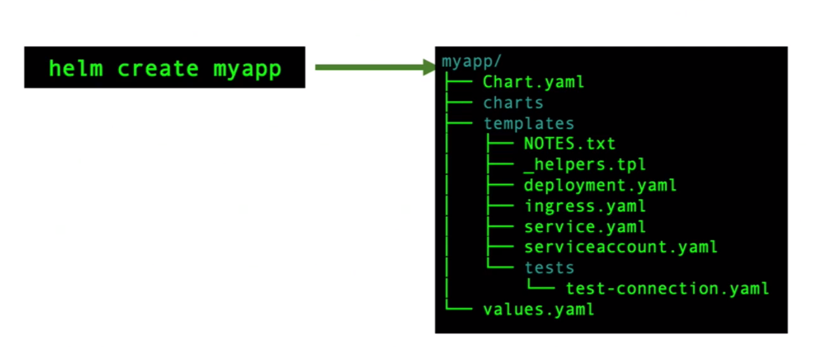
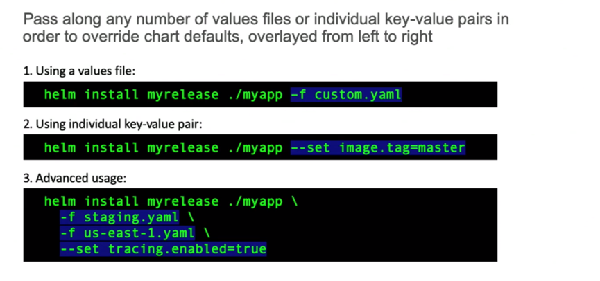

<center> 
    <h1>应用商店-Helm
    </h1></center>

# 一、简介


一个应用：（比如博客程序，wordpress+mysql）

- Deployment.yaml
- Service.yaml
- PVC.yaml
- Ingress.yaml
- xxxx




charts：图表； 发布charts


# 二、安装Helm

https://helm.sh/zh/docs/v3/intro/install


每个Helm [版本](https://github.com/helm/helm/releases)都提供了各种操作系统的二进制版本，这些版本可以手动下载和安装。

1. 下载需要的版本 ：`wget https://get.helm.sh/helm-v3.6.3-linux-amd64.tar.gz`
2. 解压(`tar -zxvf helm-v3.6.3-linux-amd64.tar.gz`)
3. 在解压目录中找到`helm`程序，移动到需要的目录中(`mv linux-amd64/helm /usr/local/bin/helm`) ；给权限：`chmod +x /usr/local/bin/helm`
4. 验证安装：`helm help`

# 三、入门使用

helm repo add bitnami "https://helm-charts.itboon.top/bitnami" 
helm repo add azure http://mirror.azure.cn/kubernetes/charts/ --force-update
...

helm repo list
bitnami     https://helm-charts.itboon.top/bitnami  【找到的国内源】
azure     	http://mirror.azure.cn/kubernetes/charts/

helm repo update


## 1、三大概念

- *Chart* 代表着 Helm 包。它包含在 Kubernetes 集群内部运行应用程序，工具或服务所需的所有资源定义。你可以把它看作是 Homebrew formula，Apt dpkg，或 Yum RPM 在Kubernetes 中的等价物。

- *Repository（仓库）* 是用来存放和共享 charts 的地方。它就像 Perl 的 [CPAN 档案库网络](https://www.cpan.org/) 或是 Fedora 的 [软件包仓库](https://fedorahosted.org/pkgdb2/)，只不过它是供 Kubernetes 包所使用的。

- *Release* 是运行在 Kubernetes 集群中的 chart 的实例。一个 chart 通常可以在同一个集群中安装多次。每一次安装都会创建一个新的 *release*。以 MySQL chart为例，如果你想在你的集群中运行两个数据库，你可以安装该chart两次。每一个数据库都会拥有它自己的 *release* 和 *release name*。

在了解了上述这些概念以后，我们就可以这样来解释 Helm：

> Helm 安装 *charts* 到 Kubernetes 集群中，每次安装都会创建一个新的 *release*。你可以在 Helm 的 chart *repositories* 中寻找新的 chart。


## 2、charts 结构


```sh
helm search repo  mysql -l | grep 8.0.
helm pull bitnami/mysql --version 10.2.1
ls
tar -zxvf mysql-10.2.1.tgz
...
[root@k8s-master mysql]# pwd
/home/lpruoyu/helm/mysql
[root@k8s-master mysql]# ls
Chart.lock  charts  Chart.yaml  README.md  templates  values.schema.json  values.yaml

# 用 helm install -f values.yaml my-mysql ./ 这种方式安装，修改values.yaml即可自定义【pv供应商的nfs路径最好搞个新的】
```








## 3、自定义变量值



## 4、推送helm chart

```sh
helm registry login --insecure 192.168.86.5
helm chart save /root/mariadb 192.168.86.5/chart/mariadb:test
helm chart push 192.168.86.5/chart/mariadb:test
helm registry logout 192.168.86.5
```

