<center>
    <h1>
        生态链路整合
    </h1>
</center>


------------------
以后`*.itdachang.com`这个通配符证书，各个名称空间都放一份

```sh
openssl req -x509 -nodes -days 365 -newkey rsa:2048 -keyout tls.key -out tls.crt -subj "/CN=*.itdachang.com/O=*.itdachang.com"

kubectl create secret tls itdachang.com --key tls.key --cert tls.crt
kubectl create secret tls itdachang.com --key tls.key --cert tls.crt -n devops
...
```

--------------

hosts：

```
192.168.10.250 itdachang.com
192.168.10.250 rook.itdachang.com
192.168.10.250 alertmanager.itdachang.com 
192.168.10.250 grafana.itdachang.com 
192.168.10.250 prometheus.itdachang.com
192.168.10.250 harbor.itdachang.com
192.168.10.250 jenkins.itdachang.com
192.168.10.250 kibana.itdachang.com
192.168.10.250 elastic.itdachang.com
192.168.10.250 gitlab.itdachang.com
192.168.10.250 alertmanager.oncloud.fun
192.168.10.250 grafana.oncloud.fun
192.168.10.250 prometheus.oncloud.fun
```

# 一、Prometheus

Prometheus：指标监控与告警专家


Prometheus 是一个以指标（Metrics）为中心的监控系统及告警工具包。它的设计初衷是实时地采集和存储应用的性能数据，如CPU使用率、请求延迟、内存消耗等数值型的时间序列数据。

核心用处：实时监控系统状态，并通过强大的查询语言 PromQL 对数据进行聚合、分析，及时发现异常并触发告警。

典型场景：监控Kubernetes集群、微服务架构、云原生应用的运行状态，是云原生计算基金会（CNCF）的顶级项目。也是 Kubernetes 监控的事实标准。

1. 核心概念：基于指标（Metrics）。它关注的是数字。比如：

  - CPU 使用率现在是 75%。

  - QPS（每秒请求数）现在是 1000。

  - 服务 A 的延迟 P99（99%的请求延迟）是 200ms。

2. 主要组件

  - Prometheus Server：核心服务器，负责拉取（Pull）和存储指标数据。

  - Client Libraries：用于对业务代码进行埋点，暴露指标。

  - Exporters：用于监控第三方系统（如 MySQL, Nginx, Linux 主机），它们负责将第三方系统的指标转换成 Prometheus 能理解的格式。

  - Alertmanager：处理告警，负责去重、分组、静默和发送通知（如邮件、钉钉、微信）。

  - Grafana：通常是可视化层，用于创建仪表盘（Dashboard），展示 Prometheus 中的数据。虽然 Prometheus 自带简单的 UI，但生产环境几乎都会搭配 Grafana。

3. 数据模型

  - 时间序列数据：每一个数据点都是由指标名和标签（键值对）唯一标识的。

  - 例如：http_requests_total{method="GET", endpoint="/api/v1/users"}

4. 查询语言：PromQL：PromQL 是 Prometheus 的查询语言，非常强大，可以灵活地对采集到的指标数据进行聚合、计算和分析。

5. 适合的场景

  - 微服务和云原生架构（特别是 Kubernetes）。

  - 需要实时告警的系统。

  - SRE（网站可靠性工程）黄金指标：延迟、流量、错误、饱和度。

6. 不适合的场景

  - 存储和检索详细的日志文本。

  - 处理非结构化的数据。

  - 需要高精度（毫秒级以下）的事件追踪。

## 0、概述

time series data 时间序列数据库


## 1、入门

### 1、docker版本

```sh
docker run -d --name prometheus --restart=always \
    -p 9090:9090 \
    -v /app/prometheus/config:/etc/prometheus \
    prom/prometheus
```

mkdir -p /app/prometheus/config
cd /app/prometheus/config
vi prometheus.yml

```yaml
# my global config
global:
  scrape_interval:     15s # Set the scrape interval to every 15 seconds. Default is every 1 minute.
  evaluation_interval: 15s # Evaluate rules every 15 seconds. The default is every 1 minute.
  # scrape_timeout is set to the global default (10s).
 
# Alertmanager configuration
alerting:
  alertmanagers:
  - static_configs:
    - targets:
       - alertmanager:9093
 
# Load rules once and periodically evaluate them according to the global 'evaluation_interval'.
rule_files:
  # - "first_rules.yml"
  # - "second_rules.yml"
 
# A scrape configuration containing exactly one endpoint to scrape:
# Here it's Prometheus itself.
scrape_configs:
  # The job name is added as a label `job=<job_name>` to any timeseries scraped from this config.
  - job_name: 'prometheus'
    # metrics_path defaults to '/metrics' # expression：要看metrics有哪些进行编写
    # scheme defaults to 'http'.
    scrape_interval: 5s
    static_configs:
    - targets: ['127.0.0.1:9090']
 
  - job_name: 'docker'
    scrape_interval: 10s
    static_configs:
      - targets: ['10.120.82.4:8080'] ## 这个安装了下面cadvisor才有,自动访问/metrics
  - job_name: 'node'  ## ； node_exporter
    scrape_interval: 5s
    static_configs:
    - targets: ['10.120.82.4:9100']
```


```sh
# 运行cadvisor 导出docker节点数据，访问 8080/metrics即可
docker run -v /:/rootfs:ro \
-v /var/run:/var/run:rw \
-v /sys:/sys:ro \
-v /var/lib/docker/:/var/lib/docker:ro \
-p 8080:8080 -d  --name=cadvisor  google/cadvisor
```


```sh
#主机监控,参照如下网址
https://grafana.com/grafana/dashboards/13978?src=grafana_gettingstarted&pg=dashboards&plcmt=featured-sub1

#创建开机启动服务.为啥不行？？？？ 可以用 nohup node_exporter &
#nohup node_exporter >> node_exporter.output.log 2>&1 &
vi /etc/systemd/system/node-exporter.service
## 内容如下,如下的配置算了
[Unit]
Description=Node Exporter

[Service]
User=node-exporter
ExecStart=/usr/local/bin/node_exporter  --config.file=agent-config.yaml
##ExecStart=/usr/local/bin/node_exporter
Restart=always

[Install]
WantedBy=multi-user.target

##创建用户
useradd --no-create-home --shell /bin/false node-exporter

## 启动
sudo systemctl daemon-reload
sudo systemctl enable node-exporter.service --now
sudo systemctl start node-exporter.service
sudo systemctl status node-exporter.service


```


```sh
docker run -d --name=grafana --restart=always -p 3000:3000 grafana/grafana
```


> 
> 准备一个程序能暴露 /metrics   k v
>
> mysql【云原生出来以前的，找exporter】：mysql_exporter
>
> java： 引入Actuator【spring-boot-starter-actuator】，也会暴露 metrics信息
>
> 云原生的一些组件，直接就能抓
>


## 2、安装


>  kube-prometheus-stack
>
> - prometheus
> - stack-charts
> - [prometheus-community/kube-state-metrics](https://github.com/prometheus-community/helm-charts/tree/main/charts/kube-state-metrics)
> - [prometheus-community/prometheus-node-exporter](https://github.com/prometheus-community/helm-charts/tree/main/charts/prometheus-node-exporter)
> - [grafana/grafana](https://github.com/grafana/helm-charts/tree/main/charts/grafana)


### 1、charts下载

```sh
helm repo add prometheus-community https://prometheus-community.github.io/helm-charts
helm repo update
helm pull prometheus-community/kube-prometheus-stack --version 16.0.0
ls
tar -xvf kube-prometheus-stack-16.0.0.tgz
cd kube-prometheus-stack/
```


### 2、定制化配置

#### 1、配置ingress访问证书

> 全局做过的就可以跳过；
>
> 只需要给全局`*.itdachang.com`加上域名的证书即可


#### 2、配置定制化文件

```yaml
vi override.yaml  #基于他的values.yaml改的

alertmanager:
  ingress: 
    enabled: true
    ingressClassName: nginx
    hosts:
      - alertmanager.itdachang.com
    paths:
      - /
    pathType: Prefix
    # tls: 
    #  - secretName: itdachang.com
    #    hosts:
    #     - alertmanager.itdachang.com
grafana:
  enabled: true
  defaultDashboardsEnabled: true
  adminPassword: Admin123456
  ingress: 
    enabled: true
    hosts: 
    - grafana.itdachang.com
    path: /
    pathType: Prefix
    # tls:
    #   - secretName: itdachang.com
    #     hosts:
    #       - grafana.itdachang.com 
  
prometheus: 
  prometheusSpec:
    additionalPodMonitors:
      - name: registry.cn-hangzhou.aliyuncs.com/lfy_k8s_images/kube-state-metrics:v2.0.0
  ingress: 
    enabled: true
    hosts: [prometheus.itdachang.com]
    paths:
      - / 
    pathType: Prefix
    # tls:
    #   - secretName: itdachang.com
    #     hosts:
    #       - prometheus.itdachang.com
```


<!-- 如果下不下来镜像可以把registry.cn-hangzhou.aliyuncs.com/lfy_k8s_images/kube-state-metrics:v2.0.0手动下载下来
然后改成k8s.gcr.io/kube-state-metrics/kube-state-metrics:v2.0.0

kubectl get pod -n monitor -owide
NAME                                                       READY   STATUS              RESTARTS   AGE     IP               NODE             NOMINATED NODE   READINESS GATES
pod/prometheus-stack-kube-state-metrics-5b568bcfd7-b888v   0/1     ImagePullBackOff    0          5m50s   172.18.83.67     k8s-ha-master3   <none>           <none>

我去 k8s-ha-master3 这个节点搞这些操作

docker pull registry.cn-hangzhou.aliyuncs.com/lfy_k8s_images/kube-state-metrics:v2.0.0

docker tag registry.cn-hangzhou.aliyuncs.com/lfy_k8s_images/kube-state-metrics:v2.0.0 k8s.gcr.io/kube-state-metrics/kube-state-metrics:v2.0.0


卸载：helm uninstall prometheus-stack  -n monitor

然后重装 -->

### 3、安装

```sh
kubectl create ns monitor
helm install -f values.yaml -f override.yaml prometheus-stack ./ -n monitor
```


> NAME: prometheus-stack
> LAST DEPLOYED: Thu May 27 11:39:52 2021
> NAMESPACE: monitor
> STATUS: deployed
> REVISION: 1
> NOTES:
> kube-prometheus-stack has been installed. Check its status by running:
>   kubectl --namespace monitor get pods -l "release=prometheus-stack"
>
> Visit https://github.com/prometheus-operator/kube-prometheus for instructions on how to create & configure Alertmanager and Prometheus instances using the Operator.


### 4、访问


alertmanager.itdachang.com 
grafana.itdachang.com 【密码：admin Admin123456】
prometheus.itdachang.com


### 5、其他想查看的

去grafana官网找对应的dashboard，拿到他的id【比如13105】，然后导入进来即可

https://grafana.com/grafana/dashboards/


# 二、Harbor

>参见Harbor部署文档.md


# 三、Gitlab【跳过】

## 1、入门

https://registry.hub.docker.com/r/gitlab/gitlab-ce

### 1、简介


### 2、docker安装

http://www.damagehead.com/docker-gitlab/   这个是一个快速docker-compose部署gitlab。参照一下即可

```sh
export GITLAB_HOME=/etc/gitlab


docker run -d \
  --hostname 10.120.82.4 \
  -p 6443:443 -p 88:80 -p 23:22 \
  --name gitlab \
  --restart always \
  --volume $GITLAB_HOME/config:/etc/gitlab \
  --volume $GITLAB_HOME/logs:/var/log/gitlab \
  --volume $GITLAB_HOME/data:/var/opt/gitlab \
  gitlab/gitlab-ce:latest
  

#一句命令安装
docker run -d \
  --hostname 10.120.82.4 \
  -p 6443:443 -p 88:80 -p 23:22 \
  --name gitlab  gitlab/gitlab-ce:latest
```


### 3、yum安装

```sh
vim /etc/yum.repos.d/gitlab-ce.repo


[gitlab-ce]
name=gitlab-ce
baseurl=http://mirrors.tuna.tsinghua.edu.cn/gitlab-ce/yum/el6
Repo_gpgcheck=0
Enabled=1
Gpgkey=https://packages.gitlab.com/gpg.key

sudo yum makecache
sudo yum install gitlab-ce        #自动安装最新版
sudo yum install gitlab-ce-x.x.x    #安装指定版本
```


```sh
sudo gitlab-ctl start    # 启动所有 gitlab 组件；
sudo gitlab-ctl stop        # 停止所有 gitlab 组件；
sudo gitlab-ctl restart        # 重启所有 gitlab 组件；
sudo gitlab-ctl status        # 查看服务状态；
sudo gitlab-ctl reconfigure        # 修改配置文件后，启动服务；
sudo vim /etc/gitlab/gitlab.rb        # 修改默认的配置文件；
gitlab-rake gitlab:check SANITIZE=true --trace    # 检查gitlab；
sudo gitlab-ctl tail        # 查看日志；
```


## 2、使用

> 远程gitlab：  http://139.198.186.134:88/   root   Admin123456


# 四、Jenkins

## 1、helm安装【这种方式部署的有点重，而且得懂他的values.yaml才能用，用手动安装吧】

```dockerfile
#可定制镜像
FROM jenkins/jenkins:lts
RUN jenkins-plugin-cli --plugins kubernetes workflow-aggregator git configuration-as-code
```


```sh
#helm 安装
helm repo add jenkinsci https://charts.jenkins.io/
helm pull jenkinsci/jenkins --version 3.3.18
```


```yaml
controller:
  componentName: "jenkins-controller"
  image: "jenkinsci/blueocean"
  tag: "1.24.7"
  imagePullPolicy: "Always"
  adminSecret: true


  adminUser: "admin"
  adminPassword: "admin"


  servicePort: 8080
  targetPort: 8080
  serviceType: ClusterIP

  healthProbes: true
  probes:
    startupProbe:
      httpGet:
        path: '{{ default "" .Values.controller.jenkinsUriPrefix }}/login'
        port: http
      periodSeconds: 10
      timeoutSeconds: 5
      failureThreshold: 12
    livenessProbe:
      failureThreshold: 5
      httpGet:
        path: '{{ default "" .Values.controller.jenkinsUriPrefix }}/login'
        port: http
      periodSeconds: 10
      timeoutSeconds: 5
    readinessProbe:
      failureThreshold: 3
      httpGet:
        path: '{{ default "" .Values.controller.jenkinsUriPrefix }}/login'
        port: http
      periodSeconds: 10
      timeoutSeconds: 5
  agentListenerServiceType: "ClusterIP"

  installPlugins:
    - kubernetes:1.29.4
    - workflow-aggregator:2.6
    - git:4.7.1
    - configuration-as-code:1.51

  initializeOnce: true

  ingress:
    enabled: true
    paths: 
    - backend:
        service:
            name: jenkins
            port:
              number: 8080
      path: "/"
      pathType: Prefix
    apiVersion: "networking.k8s.io/v1s"
    kubernetes.io/ingress.class: nginx

    hostName: jenkins.itdachang.com
    tls:
    - secretName: itdachang.com
      hosts:
        - jenkins.itdachang.com

  prometheus:
    enabled: true
    scrapeInterval: 60s
    scrapeEndpoint: /prometheus

agent:
  enabled: true
  workspaceVolume: 
     type: PVC
     claimName: jenkins-workspace-pvc
     readOnly: false

additionalAgents:
  maven:
    podName: maven
    customJenkinsLabels: maven
    image: jenkins/jnlp-agent-maven

persistence:
  enabled: true
  storageClass: "managed-nfs-storage"
  accessMode: "ReadWriteOnce"
  size: "8Gi"
```


```sh
 openssl req -x509 -nodes -days 365 -newkey rsa:2048 -keyout tls.key -out tls.cert -subj "/CN=*.itdachang.com/O=*.itdachang.com"
 
kubectl create ns devops
kubectl create secret tls itdachang.com --key tls.key --cert tls.cert -n devops
```


```sh
helm install -f values.yaml -f override.yaml jenkins ./ -n devops
```


```yaml
1. Get your 'admin' user password by running:
  kubectl exec --namespace devops -it svc/jenkins -c jenkins -- /bin/cat /run/secrets/chart-admin-password && echo

2. Visit http://jenkins.itdachang.com

3. Login with the password from step 1 and the username: admin
4. Configure security realm and authorization strategy
5. Use Jenkins Configuration as Code by specifying configScripts in your values.yaml file, see documentation: http://jenkins.itdachang.com/configuration-as-code and examples: https://github.com/jenkinsci/configuration-as-code-plugin/tree/master/demos

For more information on running Jenkins on Kubernetes, visit:
https://cloud.google.com/solutions/jenkins-on-container-engine

For more information about Jenkins Configuration as Code, visit:
https://jenkins.io/projects/jcasc/


NOTE: Consider using a custom image with pre-installed plugins
```


访问：  http://jenkins.itdachang.com:88


## 2、手动安装

### 1、编写Jenkins配置文件

vi mjenkins.yaml

```yaml
apiVersion: apps/v1
kind: StatefulSet
metadata:
  name: jenkins
  namespace: devops
spec:
  selector:
    matchLabels:
      app: jenkins # has to match .spec.template.metadata.labels
  serviceName: "jenkins"
  replicas: 1
  template:
    metadata:
      labels:
        app: jenkins # has to match .spec.selector.matchLabels
    spec:
      serviceAccountName: "jenkins"
      terminationGracePeriodSeconds: 10
      containers:
      - name: jenkins
        image: jenkins/jenkins #用最新jenkins
        securityContext:                     
          runAsUser: 0                      #设置以ROOT用户运行容器
          privileged: true                  #拥有特权
        ports:
        - containerPort: 8080
          name: web
        - name: jnlp                        #jenkins slave与集群的通信口
          containerPort: 50000
        resources:
          # limits:
          #   memory: 2Gi
          #   cpu: "2000m"
          requests:
            memory: 700Mi
            cpu: "500m"
        env:
        - name: LIMITS_MEMORY
          valueFrom:
            resourceFieldRef:
              resource: limits.memory
              divisor: 1Mi
        - name: JAVA_OPTS
          value: >-
            -Duser.timezone=Asia/Shanghai
            -XX:MaxRAMPercentage=75.0
        volumeMounts:
        - name: home
          mountPath: /var/jenkins_home
  volumeClaimTemplates:
  - metadata:
      name: home
    spec:
      accessModes: [ "ReadWriteOnce" ]
      storageClassName: "managed-nfs-storage" #可以用ceph
      resources:
        requests:
          storage: 5Gi

---
apiVersion: v1
kind: Service
metadata:
  name: jenkins
  namespace: devops
spec:
  selector:
    app: jenkins
  type: ClusterIP
  ports:
  - name: web
    port: 8080
    targetPort: 8080
    protocol: TCP
  - name: jnlp
    port: 50000
    targetPort: 50000
    protocol: TCP
---
apiVersion: networking.k8s.io/v1
kind: Ingress
metadata:
  name: jenkins
  namespace: devops
spec:
  tls:
  - hosts:
      - jenkins.itdachang.com
    secretName: itdachang.com
  rules:
  - host: jenkins.itdachang.com
    http:
      paths:
      - path: /
        pathType: Prefix
        backend:
          service:
            name: jenkins
            port:
              number: 8080
---
apiVersion: v1
kind: ServiceAccount
metadata:
  name: jenkins
  namespace: devops

---
apiVersion: rbac.authorization.k8s.io/v1
kind: ClusterRole
metadata:
  name: jenkins
rules:
  - apiGroups: ["extensions", "apps"]
    resources: ["deployments"]
    verbs: ["create", "delete", "get", "list", "watch", "patch", "update"]
  - apiGroups: [""]
    resources: ["services"]
    verbs: ["create", "delete", "get", "list", "watch", "patch", "update"]
  - apiGroups: [""]
    resources: ["pods"]
    verbs: ["create","delete","get","list","patch","update","watch"]
  - apiGroups: [""]
    resources: ["pods/exec"]
    verbs: ["create","delete","get","list","patch","update","watch"]
  - apiGroups: [""]
    resources: ["pods/log"]
    verbs: ["get","list","watch"]
  - apiGroups: [""]
    resources: ["secrets"]
    verbs: ["get"]

---
apiVersion: rbac.authorization.k8s.io/v1
kind: ClusterRoleBinding
metadata:
  name: jenkins
roleRef:
  kind: ClusterRole
  name: jenkins
  apiGroup: rbac.authorization.k8s.io
subjects:
- kind: ServiceAccount
  name: jenkins
  namespace: devops
```


> 非常好的优化文章：https://www.cnblogs.com/guguli/p/7827435.html

```sh
kubectl apply -f mjenkins.yaml
kubectl logs jenkins-0 -n devops -f
```

### 2、安装核心插件


```sh
- kubernetes
- docker


其他插件：docker pipeline 、Generic Webhook Trigger 、Email Extension Template（mailext）

>!!!!!最新版jenkins能下载！不用下面两个配置！

#以上插件可能无法下载，可以手动去jenkins官网下载并上传
kubectl cp /root/other/kubernetes-client-api.hpi devops/jenkins-0:/var/jenkins_home/plugins/

#最好配置国内镜像源
kubectl exec -it -n devops jenkins-0 -- /bin/sh
```

### 3、配置集群整合


>给节点打标签：kubectl label node k8s-node1 jnlp-node=true【加了节点选择器就可控了】


#### 1、动态slave架构

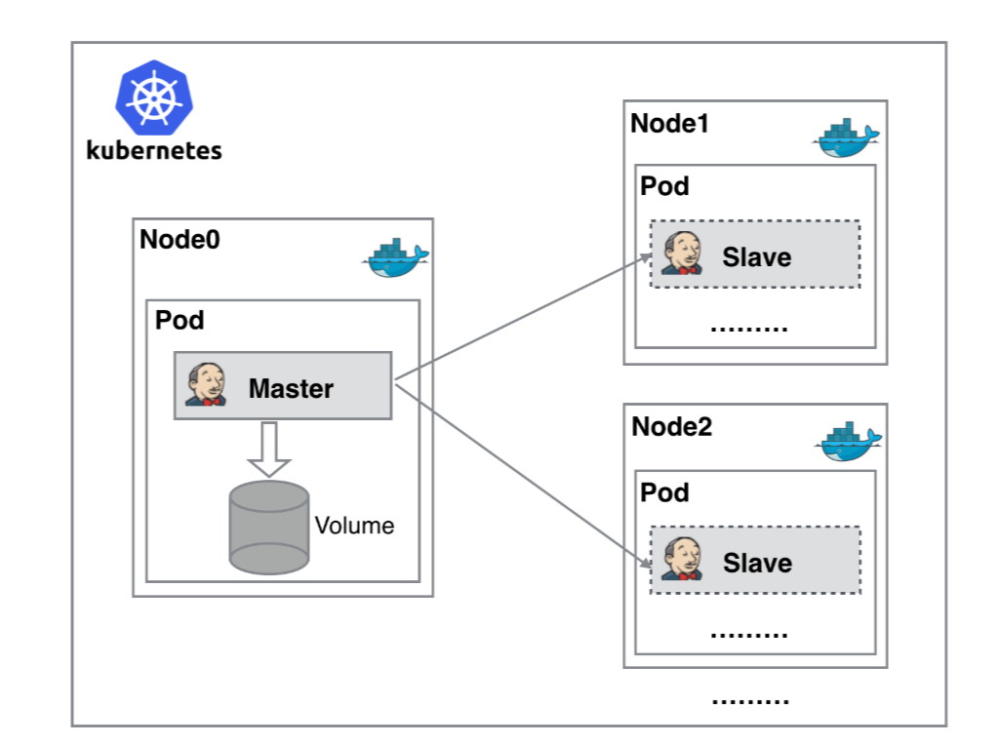


#### 2、配置整合


https://jenkins.itdachang.com/configureClouds/


点击《系统管理》—>《Configure System》—>《配置一个云》—>《kubernetes》，如下：

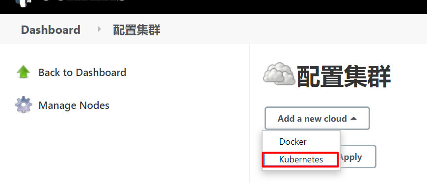


#### 3、配置kubernetes集群信息

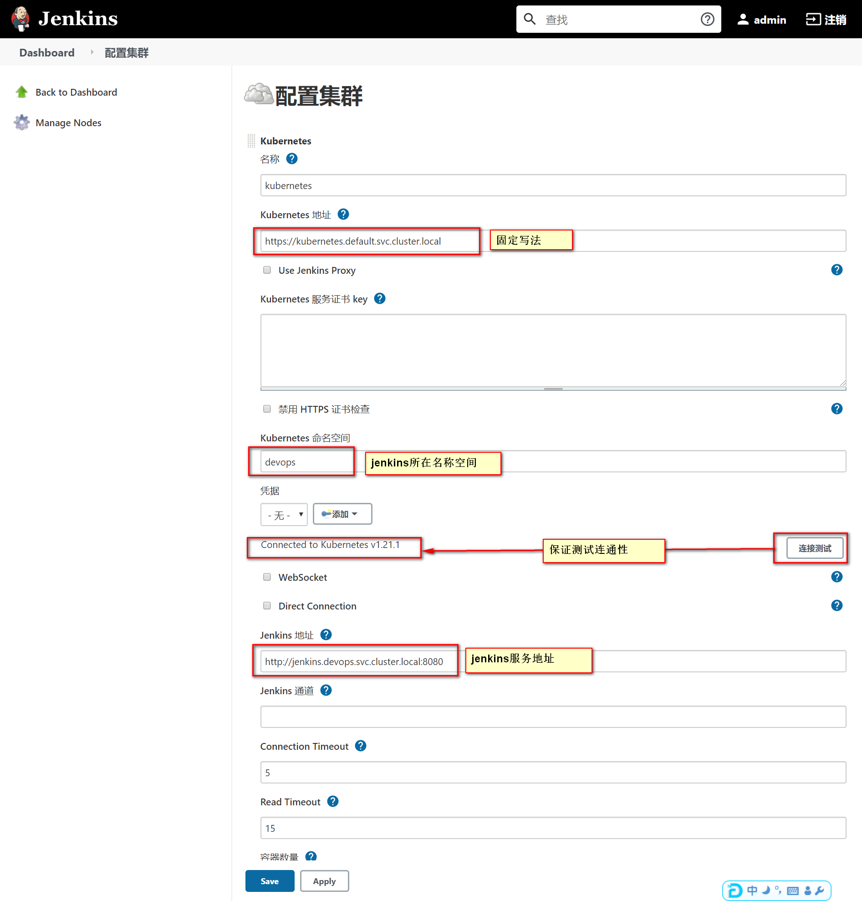


#### 4、配置slave的pod模板

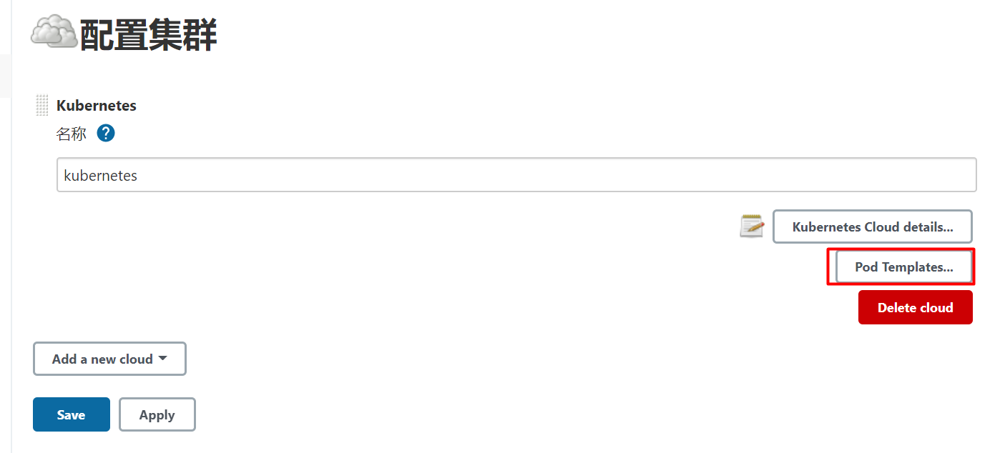


> Slave就是动态运行起来的容器环境.
>
> jenkins的所有构建命令会在这个容器里面运行
>
> - 注意配置以下内容
>   - 名称: `自定义`
>   - 命名空间 :  `devops`
>   - 标签列表:  `自定义`
>   - 容器名称、镜像： `jenkins/inbound-agent:4.7-1-alpine`
>   - serviceAccount挂载项: `jenkins`
>   - `运行命令`: 改为 `jenkins-slave`
>
> 注意：
>
> - jenkins-url如果是一个域名，测试环境下可能不能访问，此时需要给各个主机配置域名转发到vpc网络的ip
> - 修改各个主机的 /etc/hosts文件即可
> - 也可以直接设置jenkins-url为公网ip地址


## 3、slave配置参考


> 下面的截图忘了选中 user,group 都应该为 0,0  也就是root用户
>
> 每个打包机都应该hostPath模式挂载/etc/hosts文件。方便统一域名管理。或者全系统内部都不用域名，都使用ip进行交互也可以【但是推荐域名，域名可以统一修改，ip变化所有引用的地方都来修改很麻烦】


### 0、slave镜像

| slave-label | 镜像                                                         | 集成工具                                                |
| ----------- | ------------------------------------------------------------ | ------------------------------------------------------- |
| maven       | registry.cn-hangzhou.aliyuncs.com/lfy_k8s_images/jnlp-maven:3.6.3 | jq、curl、maven                                         |
| nodejs      | registry.cn-hangzhou.aliyuncs.com/lfy_k8s_images/jnlp-nodejs:14.16.1 | jq、curl、nodejs、npm（已经设置全局目录在 /root/npm下） |
| kubectl     | registry.cn-hangzhou.aliyuncs.com/lfy_k8s_images/jnlp-kubectl:1.21.1 | kubectl、helm、helm-push、jq、curl、                    |
| docker      | registry.cn-hangzhou.aliyuncs.com/lfy_k8s_images/jnlp-docker:20.10.2 | jq、curl、docker                                        |


> 根据自己环境可以有很多定制的slave

### 1、maven配置

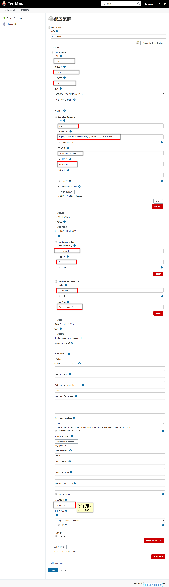

> 使用要求
>
> - 1、提前创建好maven的settings.xml，并且以configMap的形式保存到k8s集群的devops名称空间。configmap名叫`maven-conf`，里面有一个键名`settings.xml`，值为 `maven配置文件的值`： `kubectl create configmap maven-conf --from-file=settings.xml=/root/settings.xml -n devops`
>
> - 2、准备名为`maven-jar-pvc` 的pvc 在 devops名称空间下。为RWX模式
>

```xml
<?xml version="1.0" encoding="UTF-8"?>

<settings xmlns="http://maven.apache.org/SETTINGS/1.0.0"
          xmlns:xsi="http://www.w3.org/2001/XMLSchema-instance"
          xsi:schemaLocation="http://maven.apache.org/SETTINGS/1.0.0 http://maven.apache.org/xsd/settings-1.0.0.xsd">
  <!-- 这个目录是被maven打包机使用pvc挂载出去的
  -->
  <localRepository>/root/maven/.m2</localRepository>

  <pluginGroups>

  </pluginGroups>

  <proxies>

  </proxies>


  <servers>

  </servers>

  <mirrors>
	 <mirror>
        <id>nexus-aliyun</id>
        <mirrorOf>central</mirrorOf>
        <name>Nexus aliyun</name>
        <url>http://maven.aliyun.com/nexus/content/groups/public</url>
	 </mirror>
  </mirrors>
  <profiles>
		<profile>
			 <id>jdk-1.8</id>
			 <activation>
			   <activeByDefault>true</activeByDefault>
			   <jdk>1.8</jdk>
			 </activation>
			 <properties>
			   <maven.compiler.source>1.8</maven.compiler.source>
			   <maven.compiler.target>1.8</maven.compiler.target>
			   <maven.compiler.compilerVersion>1.8</maven.compiler.compilerVersion>
			 </properties>
		</profile>
  </profiles>
</settings>

```


```yaml
apiVersion: v1
kind: PersistentVolumeClaim
metadata:
  name: maven-jar-pvc
  namespace: devops
  labels:
    app: maven-jar-pvc
spec:
  storageClassName: rook-cephfs
  accessModes:
  - ReadWriteMany
  resources:
    requests:
      storage: 5Gi
```


### 2、kubectl配置

在容器内/root/.kube/config，config文件的内容是我们集群之前的admin.conf的内容，也被放在了集群的/root/.kube/config

> 使用要求
>
> - 必须提前给集群创建一个ConfigMap，名叫 `kubectl-admin.conf`，里面有一个键名叫`config`，键值可以是master节点 /root/.kube/config的内容
> - 例如
> - `kubectl create configmap kubectl-admin.conf --from-file=config=/root/.kube/config -n devops`

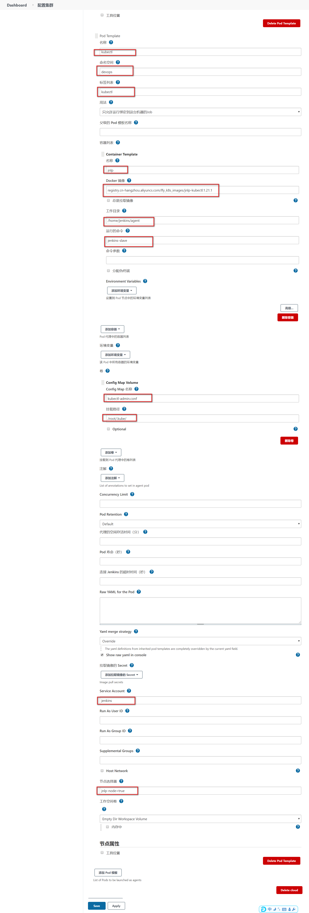


### 3、nodejs配置

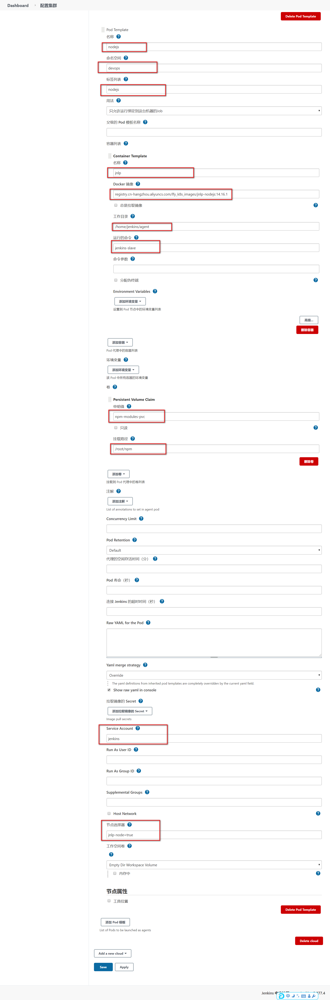

> 使用说明
>
> - 准备名为`npm-modules-pvc` 的pvc 在 devops名称空间下。为RWX模式
>
> ```yaml
> apiVersion: v1
> kind: PersistentVolumeClaim
> metadata:
>     name: npm-modules-pvc
>     namespace: devops
>     labels:
>        app: npm-modules-pvc
> spec:
>     storageClassName: rook-cephfs
>     accessModes:
>     - ReadWriteMany
>     resources:
>        requests:
>          storage: 5Gi
> ```
>
> 


### 4、docker配置

> 使用注意：
>
> - docker访问harbor之类的私有仓库且是https，要注意配置证书受信任。提前各个机器配置好

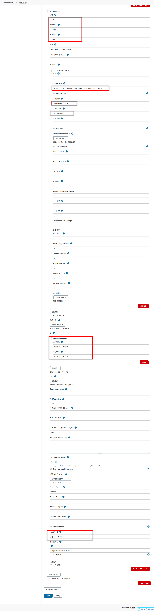


## 4、打包机检查

```groovy
pipeline {
    //无代理，各阶段声明自己的代理
    agent none
    stages {
        stage('检查nodejs打包机') {
            agent {
                label 'nodejs'
            }
            steps {
                echo "nodejs版本："
                sh 'node -v'
                echo "npm modules目录位置"
                sh 'npm config ls -l | grep prefix'
                echo "检查完成..."
            }
        }

        stage('检查maven打包机') {
            agent {
                label 'maven'
            }
            steps {
                echo "maven版本："
                sh 'mvn -v'
                echo "maven配置文件"
                sh 'cat /root/maven/settings.xml'

                echo "maven目录位置信息"
                sh 'ls -al /root/maven/'
            }
        }
        stage('检查docker打包机') {
            agent {
                label 'docker'
            }
            steps {
                echo "docker版本："
                sh 'docker version'
                sh 'docker images'
            }
        }

        stage('检查kubectl打包机') {
            agent {
                label 'kubectl'
            }
            steps {
                echo "kubectl版本："
                sh ' kubectl version'
                echo "kubectl操作集群: 所有Pod"
                sh 'kubectl get pods'

                echo "kubectl操作集群: 所有nodes"
                sh 'kubectl get nodes'
            }
        }
    }
}
```


```sh
# 运行该流水线脚本，观察k8s
watch -n 1 kubectl get pod -n devops
```


# 四、Jenkins测试：用这个【雷神的太老了】


### 前提


给节点打标签：`kubectl label node k8s-node1 jnlp-node=true`【加了节点选择器就可控了】


点击《系统管理》—>《Configure System》—>《配置一个云》—>《kubernetes》，如下：


配置kubernetes集群信息


### 测试——不配Pod模板


>检查 Jenkins 主节点的 Java 版本，可以在 Jenkins 脚本控制台（Manage Jenkins → Script Console）中执行：`System.getProperty("java.version")`


操作maven：

```
pipeline {
  agent {
    kubernetes {
      yaml """
apiVersion: v1
kind: Pod
spec:
  containers:
  - name: jnlp #jnlp是用来通信的
    image: jenkins/inbound-agent:latest-jdk21   #用对应jenkins的java版本
    args: ["\$(JENKINS_SECRET)", "\$(JENKINS_NAME)"]
  - name: maven
    image: maven:3.9.9-eclipse-temurin-17
    command: ['cat']
    tty: true
"""
    }
  }
  stages {
    stage('Check Maven') {
      steps {
        container('maven') {
          sh 'mvn -version'
        }
      }
    }
  }
}
```


操作kubectl

 `kubectl create configmap kubectl-admin.conf --from-file=config=/root/.kube/config -n devops`

```
pipeline {
  agent {
    kubernetes {
      yaml """
apiVersion: v1
kind: Pod
metadata:
  namespace: devops
spec:
  volumes:
  - name: kube-config
    configMap:
      name: kubectl-admin.conf
  serviceAccountName: jenkins   # 根据权限需要设置
  containers:
  - name: jnlp
    image: jenkins/inbound-agent:latest-jdk21  #用对应jenkins的java版本
    args: ["\$(JENKINS_SECRET)", "\$(JENKINS_NAME)"]
  - name: kubectl
    image: bitnami/kubectl:1.21 #与k8s版本一致
    command: ['sleep', 'infinity']
    env:
    - name: KUBECONFIG
      value: /root/.kube/config  
    volumeMounts:
    - name: kube-config
      mountPath: /root/.kube/     
    securityContext:                      
      runAsUser: 0
      runAsGroup: 0
"""
    }
  }
  stages {
    stage('Test kubectl') {
      steps {
        container('kubectl') {
          echo '开始执行 kubectl 命令'
          sh 'kubectl get pods -owide'
          echo 'kubectl 命令执行完毕'
        }
      }
    }
  }
}
```

操作docker && kubectl

```
pipeline {
  agent {
    kubernetes {
      yaml """
apiVersion: v1
kind: Pod
metadata:
  namespace: devops
spec:
  serviceAccountName: jenkins
  volumes:
  - name: kube-config
    configMap:
      name: kubectl-admin.conf
  # 新增hostPath卷，挂载宿主机Docker socket
  - name: docker-socket
    hostPath:
      path: /var/run/docker.sock
      type: Socket
  containers:
  - name: jnlp
    image: jenkins/inbound-agent:latest-jdk21
    args: ["\$(JENKINS_SECRET)", "\$(JENKINS_NAME)"]
  - name: kubectl
    image: bitnami/kubectl:1.21
    command: ['sleep', 'infinity']
    env:
    - name: KUBECONFIG
      value: /root/.kube/config
    volumeMounts:
    - name: kube-config
      mountPath: /root/.kube/
    securityContext:
      runAsUser: 0
      runAsGroup: 0
  # docker容器，用于执行docker命令
  - name: docker
    image: docker:stable
    command: ['sleep', 'infinity']
    volumeMounts:
    - name: docker-socket
      mountPath: /var/run/docker.sock
    securityContext:
      runAsUser: 0
      runAsGroup: 0
"""
    }
  }
  stages {
    stage('Test kubectl') {
      steps {
        container('kubectl') {
          echo '开始执行 kubectl 命令'
          sh 'kubectl get pods -owide'
          echo 'kubectl 命令执行完毕'
        }
      }
    }
    // 如需使用docker，可添加如下stage
    stage('Test docker') {
      steps {
        container('docker') {
          echo '开始执行 docker 命令'
          sh 'docker version'
          sh 'docker ps'
          echo 'docker 命令执行完毕'
        }
      }
    }
  }
}
```


### 测试——配Pod模板


docker模板：

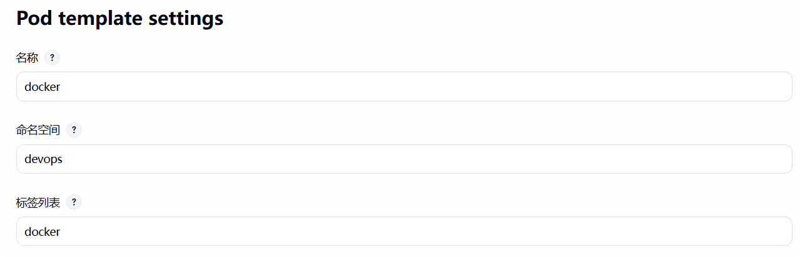

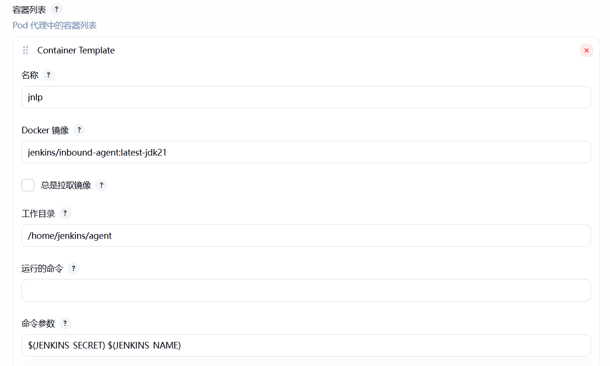

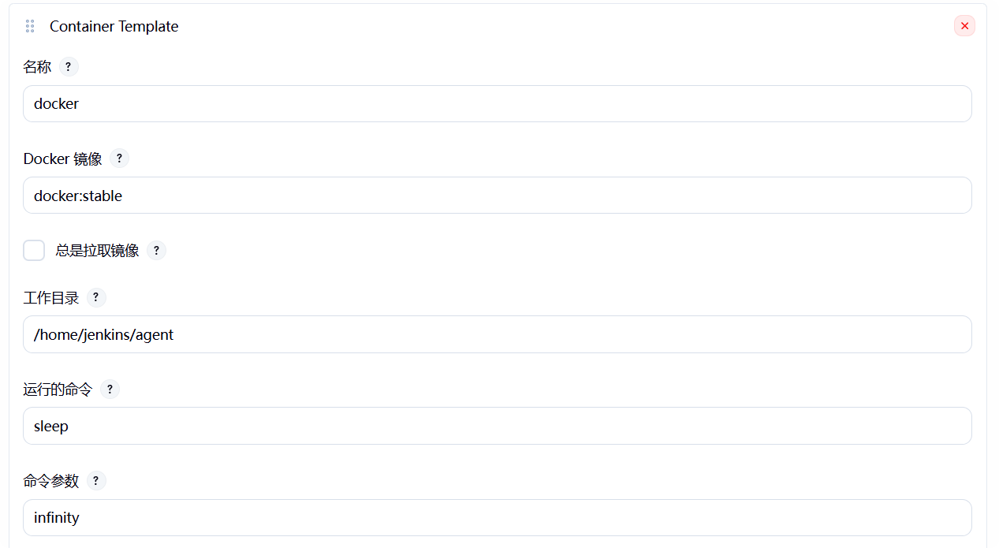

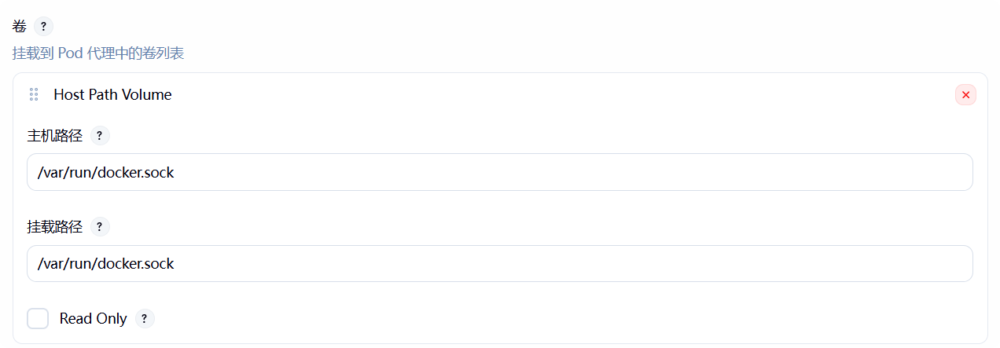

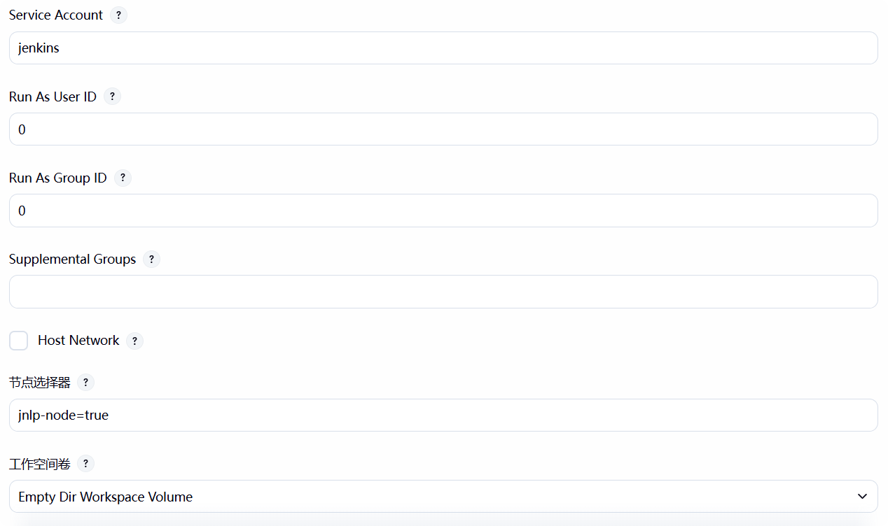


kubectl模板：


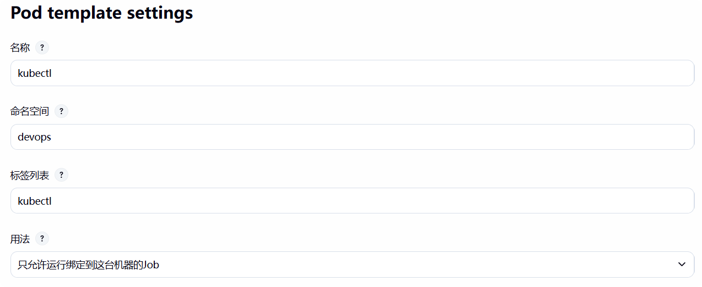


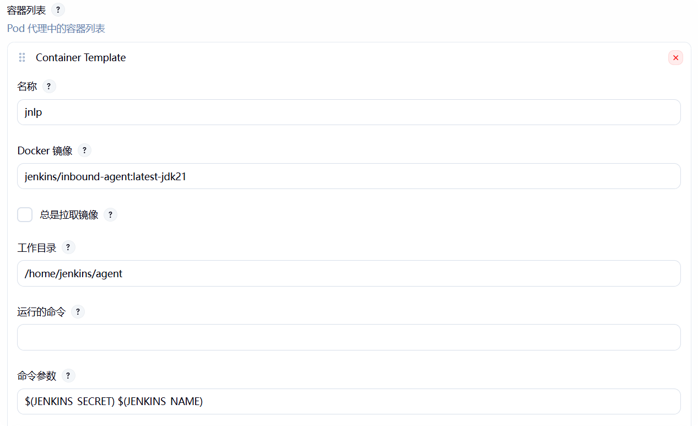


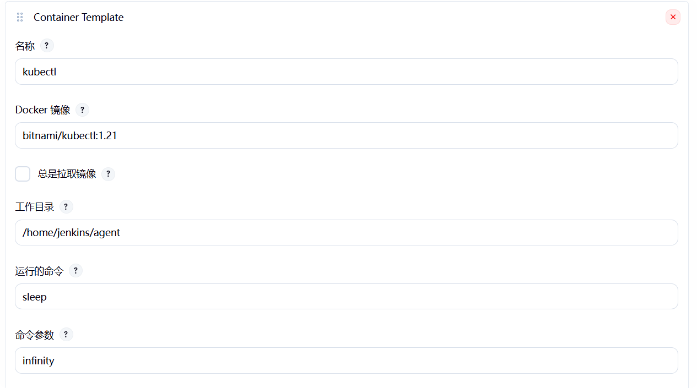


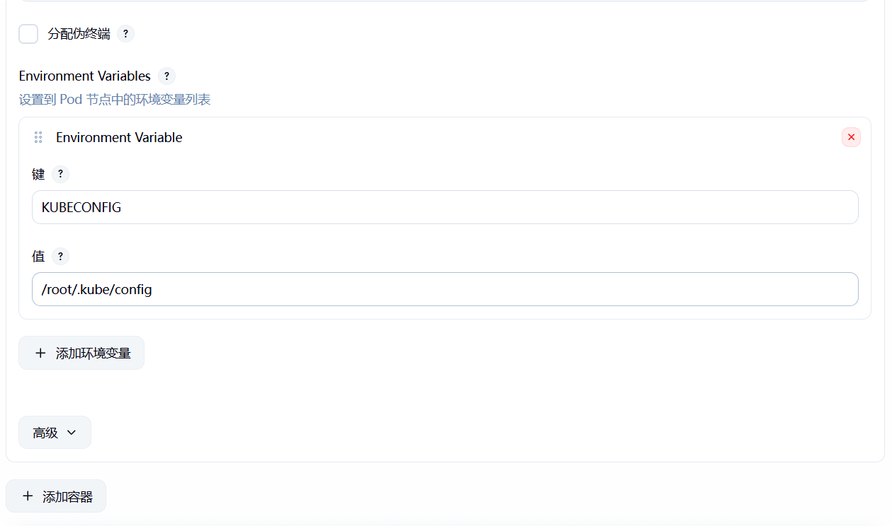


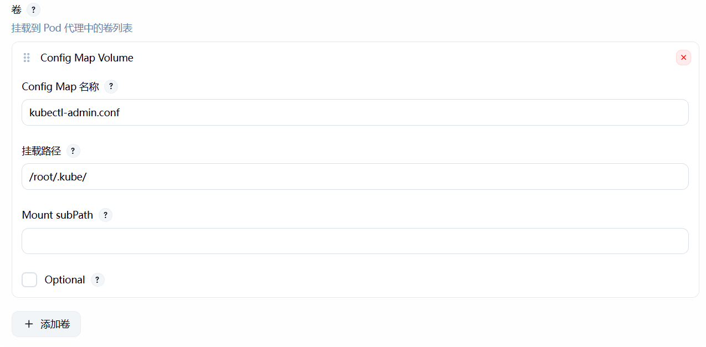

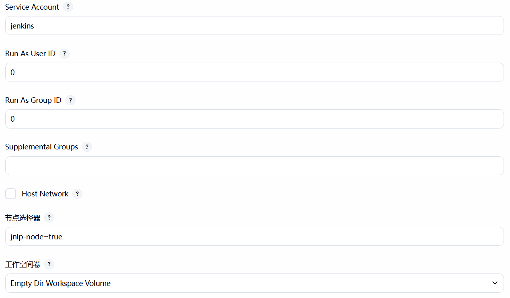


docker流水线测试：

```yaml
pipeline {
    //无代理，各阶段声明自己的代理
    agent none
    stages {
        stage('检查docker打包机') {
            agent {
                label 'docker'
            }
            steps {
              container('docker') {
                echo '开始执行 docker 命令'
                sh 'docker version'
                sh 'docker ps'
                echo 'docker 命令执行完毕'
              }
            }
        }
    }
}
```


kubectl流水线测试：

```yaml
pipeline {
    //无代理，各阶段声明自己的代理
    agent none
    stages {
        stage('检查kubectl打包机') {
            agent {
                label 'kubectl'
            }
            steps {
                container('kubectl') {
                echo '开始执行 kubectl 命令'
                sh 'kubectl get all -owide'
                sh 'kubectl get pods -owide'
                echo 'kubectl 命令执行完毕'
              }
            }
        }
    }
}
```


两个一起测试：

```yaml
pipeline {
    //无代理，各阶段声明自己的代理
    agent none
    stages {
        stage('检查docker打包机') {
            agent {
                label 'docker'
            }
            steps {
              container('docker') {
                echo '开始执行 docker 命令'
                sh 'docker version'
                sh 'docker ps'
                echo 'docker 命令执行完毕'
              }
            }
        }
        stage('检查kubectl打包机') {
            agent {
                label 'kubectl'
            }
            steps {
                container('kubectl') {
                echo '开始执行 kubectl 命令'
                sh 'kubectl get pods -owide'
                echo 'kubectl 命令执行完毕'
              }
            }
        }
    }
}
```


# 五、kustomize

## 1、是什么

https://kustomize.io/  Kubernetes本地的配置管理工具。轻量版的helm；

> 以后我们公司自己部署的一些中间件等，可以封装为 kustomize 管理的文件结构。
>
> 只需要`kubectl apply -k` 即可快速部署不同环境应用


## 2、用法


#### 1、文件结构

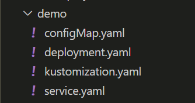


#### 2、文件内容

```yaml
#service.yaml
kind: Service
apiVersion: v1
metadata:
  name: the-service
spec:
  selector:
    deployment: hello
  type: ClusterIP
  ports:
  - protocol: TCP
    port: 8666
    targetPort: 8080
```


```yaml
#kustomization.yaml
apiVersion: kustomize.config.k8s.io/v1beta1
kind: Kustomization
metadata:
  name: arbitrary
# Example configuration for the webserver
# at https://github.com/monopole/hello
commonLabels:
  app: hello  # 构建出来的每个资源上都有app=hello标签
resources:
- deployment.yaml
- service.yaml
- configMap.yaml
```


```yaml
#configMap.yaml
apiVersion: v1
kind: ConfigMap
metadata:
  name: the-map
data:
  altGreeting: "Good Morning!"
  enableRisky: "false"
```

```yaml
#deployment.yaml
apiVersion: apps/v1
kind: Deployment
metadata:
  name: the-deployment
spec:
  replicas: 3
  selector:
    matchLabels:
      deployment: hello
  template:
    metadata:
      labels:
        deployment: hello
    spec:
      containers:
      - name: the-container
        image: monopole/hello:1
        command: ["/hello",
                  "--port=8080",
                  "--enableRiskyFeature=$(ENABLE_RISKY)"]
        ports:
        - containerPort: 8080
        env:
        - name: ALT_GREETING
          valueFrom:
            configMapKeyRef:
              name: the-map
              key: altGreeting
        - name: ENABLE_RISKY
          valueFrom:
            configMapKeyRef:
              name: the-map
              key: enableRisky
```


#### 3、使用

```sh
kubectl apply -k demo

kubectl delete -k demo
```


#### 4、注意事项

- kustomization.yaml 文件名是固定的；
- kubectl apply -k  path 会自动找path下的kustomization.yaml 
- [kustomzition文件能写的内容](https://kubectl.docs.kubernetes.io/guides/config_management/)


#### 5、高级-环境分离

- 创建  [overlay](https://kubectl.docs.kubernetes.io/references/kustomize/glossary/#overlay),分离各个环境。原来的可以抽取为`base`环境。其他环境层可只定义变量覆盖
- 每个环境层定义自己的 kustomization.yaml

- 新的层级结构
- 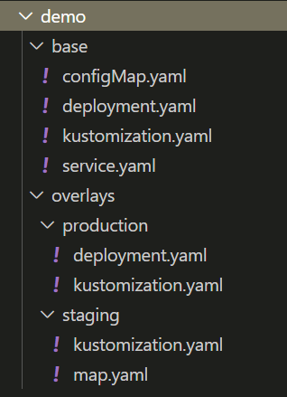


- 多的内容

  - ```yaml
    #production/kustomization.yaml
    apiVersion: kustomize.config.k8s.io/v1beta1
    kind: Kustomization
    namePrefix: production-
    commonLabels:
      variant: production
      org: acmeCorporation
    commonAnnotations:
      note: Hello, I am production!
    bases:
    - ../../base
    patchesStrategicMerge:
    - deployment.yaml
    
    #production/deployment.yaml
    apiVersion: apps/v1
    kind: Deployment
    metadata:
      name: the-deployment
    spec:
      replicas: 10
    ## 只需要定义可变部分
    ```

  - ```yaml
    #staging/kustomization.yaml
    apiVersion: kustomize.config.k8s.io/v1beta1
    kind: Kustomization
    namePrefix: staging-   #所有资源的前缀
    commonLabels:   #所有资源的标签
      variant: staging   
      org: acmeCorporation
    commonAnnotations:  #所有资源的注解
      note: Hello, I am staging!
    bases:
    - ../../base  #基础配置的位置
    patchesStrategicMerge:
    - map.yaml  #需要额外引入部署的内容，如果引入的内容基础内容有配置，则使用这个最新的
    
    #staging/map.yaml
    apiVersion: v1
    kind: ConfigMap
    metadata:
      name: the-map
    data:
      altGreeting: "Have a pineapple!"
      enableRisky: "true"  
    ```

- 执行命令

- ```sh
  kubectl apply -k demo/base

  kubectl apply -k demo/overlays/production
  kubectl apply -k demo/overlays/staging -n hello   #可以在部署的时候统一制定名称空间
  ```


# 六、整合EFK


## 0、概念


ELK Stack 专注于日志管理和分析（基于日志 Logs）。ELK 是三个开源项目的首字母缩写，后来加入了轻量级数据采集器 Beats，演变为 Elastic Stack。它是一个端到端的日志分析和数据可视化平台。


------------


ECK (Elastic Cloud on Kubernetes)：这是 Elastic 公司官方推出的 Kubernetes Operator，本质上是Elastic Stack在K8s上的"自动化管家"。它的核心职责是让你能通过简单的 YAML 配置文件，在 Kubernetes 上轻松地部署、管理和运维一整套 Elasticsearch、Kibana 等组件。你只需要告诉 ECK 想要一个什么样的 Elasticsearch 集群（比如几个节点、多大存储），ECK 就会自动帮你完成所有复杂的部署和配置工作。


-------------------------------


Logstash：服务器端的数据处理管道，能够从多个来源采集数据，并实时对数据进行转换、过滤和丰富，然后发送到 Elasticsearch。

Elasticsearch：核心存储和检索引擎。它是一个分布式、RESTful 风格的搜索和分析引擎，能对海量数据进行近乎实时的存储、搜索和分析。

Kibana：可视化层。提供数据探索、仪表盘、图表和地图等功能，让用户通过 Web 界面与 Elasticsearch 中的数据进行交互。

Beats：轻量级数据采集器。部署在服务器上作为代理，将各种类型的数据发送给 Logstash 或 Elasticsearch。例如：

Filebeat：用于采集日志文件。

Metricbeat：用于采集指标数据（与 Prometheus 功能有重叠）。

Packetbeat：用于采集网络数据。

------------------------------


部署前预习

>
> - ElasticSearch 的配置文件位置: https://www.elastic.co/guide/en/elasticsearch/reference/7.13/settings.html#config-files-location
> - 简单的 ElasticSearch 配置管理章节：https://www.elastic.co/guide/cn/elasticsearch/guide/current/_configuration_management.html
> - ElasticStack 安装：https://www.elastic.co/guide/en/elastic-stack/current/installing-elastic-stack.html#install-order-elastic-stack
> - kompose 转换 compose 为k8s文件：https://github.com/kubernetes/kompose/tree/v1.21.0
> - kubectl get pvc -n devops| grep es | awk '{print $1}' | xargs kubectl delete pvc -n devops


## 1、安装operator


安装： https://www.elastic.co/guide/en/cloud-on-k8s/current/k8s-quickstart.html


ECK安装的每个组件如何配置: https://www.elastic.co/guide/en/cloud-on-k8s/current/k8s-orchestrating-elastic-stack-applications.html


```sh
kubectl apply -f https://download.elastic.co/downloads/eck/1.6.0/all-in-one.yaml

watch kubectl -n elastic-system get pod
```


## 2、部署ES集群

```yaml
apiVersion: elasticsearch.k8s.elastic.co/v1
kind: Elasticsearch
metadata:
  name: es-cluster
  # 可以指定名称空间
spec:
  version: 7.13.1
  nodeSets:
  - name: masters
    count: 3
    config:
      node.roles: ["master"]
      xpack.ml.enabled: true
    volumeClaimTemplates:
    - metadata:
        name: es-master
      spec:
        accessModes:
        - ReadWriteOnce
        resources:
          requests:
            storage: 5Gi
        storageClassName: "rook-ceph-block"
  - name: data
    count: 4
    config:
      node.roles: ["data", "ingest", "ml", "transform"]
    volumeClaimTemplates:
    - metadata:
        name: es-node
      spec:
        accessModes:
        - ReadWriteOnce
        resources:
          requests:
            storage: 5Gi
        storageClassName: "rook-ceph-block"
```


### 1、本地访问密码测试

```sh
## elastic的访问
kubectl get secret es-cluster-es-elastic-user -o=jsonpath='{.data.elastic}' | base64 --decode; echo

## 1、集群内组件访问
###账号 elastic
###密码 2WC5On8Xio6EK4x4ph1T7Q54
curl -u "elastic:2WC5On8Xio6EK4x4ph1T7Q54" -k "https://es-cluster-es-http:9200"
curl -u "elastic:2WC5On8Xio6EK4x4ph1T7Q54" -k "https://10.96.9.9:9200"

## 2、集群本地访问
kubectl port-forward service/es-cluster-es-http 9200
curl -u "elastic:$PASSWORD" -k "https://localhost:9200"

## 3、做成下面的Ingress访问
```


### 2、部署ingress访问

```yaml
apiVersion: networking.k8s.io/v1
kind: Ingress
metadata:
  name: elastic-ingress
  annotations:
    kubernetes.io/ingress.class: "nginx"
    nginx.ingress.kubernetes.io/backend-protocol: "HTTPS"
    nginx.ingress.kubernetes.io/server-snippet: |
      proxy_ssl_verify off;
spec:
  tls:
  - hosts:
      - elastic.itdachang.com
    secretName: itdachang.com
  rules:
  - host: elastic.itdachang.com
    http:
      paths:
      - path: /
        pathType: Prefix
        backend:
          service:
            name: es-cluster-es-http
            port:
              number: 9200
```


## 3、部署kibana

```yaml
apiVersion: kibana.k8s.elastic.co/v1
kind: Kibana
metadata:
  name: kibana
spec:
  version: 7.13.1
  count: 1
  elasticsearchRef:
    name: es-cluster
```

配置Ingress

```yaml
apiVersion: networking.k8s.io/v1
kind: Ingress
metadata:
  name: kibana-ingress
  annotations:
    kubernetes.io/ingress.class: "nginx"
    nginx.ingress.kubernetes.io/backend-protocol: "HTTPS"
    nginx.ingress.kubernetes.io/server-snippet: |
      proxy_ssl_verify off;
spec:
  tls:
  - hosts:
      - kibana.itdachang.com
    secretName: itdachang.com
  rules:
  - host: kibana.itdachang.com
    http:
      paths:
      - path: /
        pathType: Prefix
        backend:
          service:
            name: kibana-kb-http
            port:
              number: 5601
```


## 4、部署FileBeats


```yaml
apiVersion: beat.k8s.elastic.co/v1beta1
kind: Beat
metadata:
  name: beats
spec:
  type: filebeat
  version: 7.13.1
  elasticsearchRef:
    name: es-cluster
  config:
    filebeat.inputs:
    - type: container
      paths:
      - /var/log/containers/*.log
  daemonSet:
    podTemplate:
      spec:
        dnsPolicy: ClusterFirstWithHostNet
        hostNetwork: true
        securityContext:
          runAsUser: 0
        containers:
        - name: filebeat
          volumeMounts:
          - name: varlogcontainers
            mountPath: /var/log/containers
          - name: varlogpods
            mountPath: /var/log/pods
          - name: varlibdockercontainers
            mountPath: /var/lib/docker/containers
        volumes:
        - name: varlogcontainers
          hostPath:
            path: /var/log/containers
        - name: varlogpods
          hostPath:
            path: /var/log/pods
        - name: varlibdockercontainers
          hostPath:
            path: /var/lib/docker/containers
```


# 7、可观测性系统

一个现代的可观测性体系（Observability）通常包含三部分：

指标（Metrics）：Prometheus（告诉你系统现在怎么了）。

日志（Logs）：ELK Stack（告诉你为什么会这样）。

链路追踪（Traces）：Jaeger 或 Zipkin（告诉你一次请求在各个服务之间的完整路径）。


