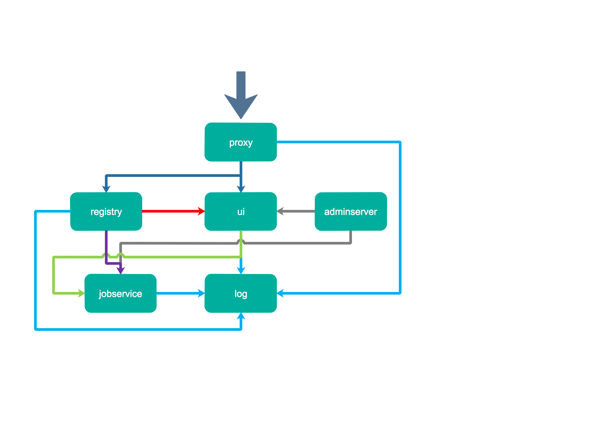
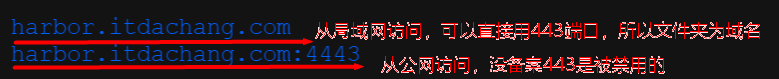
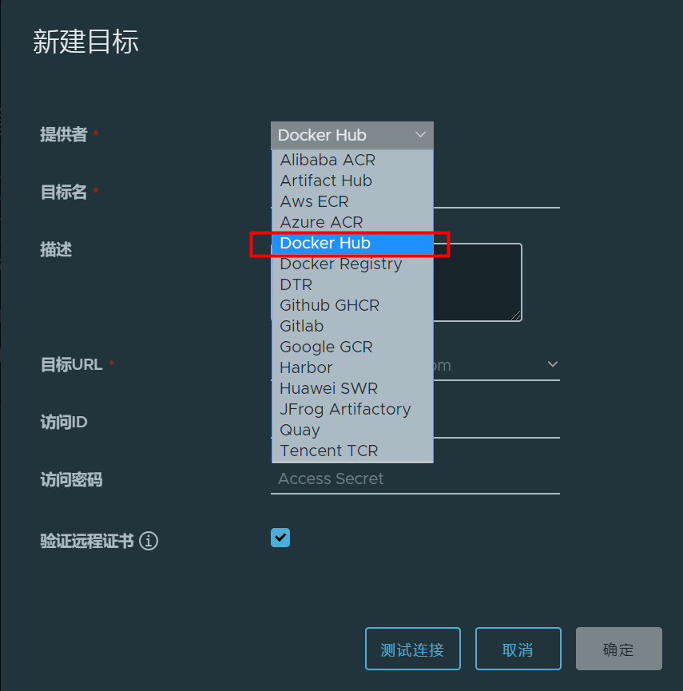

## 0、Harbor介绍


Harbor是啥：

- 私有仓库：可以保存charts、images、...

- Harbor还可以充当docker hub的中转站，代理docker hub

核心组件：



- Nginx(Proxy)：用于代理Harbor的registry,UI, token等服务
- db：负责储存用户权限、审计日志、Dockerimage分组信息等数据。
- UI：提供图形化界面，帮助用户管理registry上的镜像, 并对用户进行授权
- jobsevice：负责镜像复制工作的，他和registry通信，从一个registry pull镜像然后push到另一个registry，并记录job_log
- Adminserver：是系统的配置管理中心附带检查存储用量，ui和jobserver启动时候回需要加载adminserver的配置。
- Registry：原生的docker镜像仓库，负责存储镜像文件。
- Log：为了帮助监控Harbor运行，负责收集其他组件的log，记录到syslog中


## 1、基本环境

自定义域名（自签的证书），docker不能信任该证书；我们要让各个docker节点都信任这个证书

由于harbor使用的是https。所以需要docker信任这个https；

```sh
# 把以前总ingress的证书的文件 复制到 各个需要使用harbor的装了docker的节点的  /etc/docker/certs.d/harbor.itdachang.com/tls.crt

mkdir -p /etc/docker/certs.d/harbor.itdachang.com/

for NODE in k8s-ha-master1 k8s-ha-master2 k8s-ha-master3 k8s-ha-node1 k8s-ha-node2 k8s-ha-node3; do
    scp /root/crt/itdachang/tls.crt root@$NODE:/etc/docker/certs.d/harbor.itdachang.com/
done
```


给所有docker机器配置/etc/hosts：

```sh
#随便一个安装了ingress的节点的ip harbor.itdachang.com
192.168.10.147 harbor.itdachang.com
```


> 云上`自定义域名`如下操作：
>
> 1、配置每个主机的 /etc/hosts文件。可指定域名地址为 `公网ip`或者`ingress节点所在ip`
>
> 2、在 `/etc/docker/certs.d/` 下面准备域名文件夹（包含非默认的端口号），并把域名的 `cert/crt`文件复制进去。并且修改文件名叫  `xxx.crt`，不能是cert文件
>
> 
>
> 3、建议配置 ingress节点所在ip 。这样我们使用域名来到了ingress节点。ingress节点的nginx监听到了此域名，则转发给指定服务
>
> 


## 2、部署harbor


```sh
# 下载
helm repo add harbor https://helm.goharbor.io
helm pull harbor/harbor


我要harbor-1.6.2.tgz

helm pull harbor/harbor --version 1.6.2

tar -xvf harbor-1.6.2.tgz

cd harbor && ls
```


```sh
# kubectl create ns devops
kubectl create namespace devops
#tls.key、tls.crt用之前的ingress的总证书即可
kubectl create secret tls itdachang.com --cert=tls.crt   --key=tls.key  -n devops
```


harbor内部组件用harbor默认带的证书（在harbor/cert目录下）。ingress需要用自己证书

```yaml

# 修改配置  vi  override.yaml
expose:  #web浏览器访问用的证书
  type: ingress
  tls:
    certSource: "secret"
    secret:
      secretName: "itdachang.com"
      notarySecretName: "itdachang.com"
  ingress:
    hosts:
      core: harbor.itdachang.com
      notary: notary-harbor.itdachang.com
externalURL: https://harbor.itdachang.com
internalTLS:  #harbor内部组件用的证书
  enabled: true
  certSource: "auto"
persistence:
  enabled: true
  resourcePolicy: "keep"
  persistentVolumeClaim:
    registry:  # 存镜像的
      storageClass: "rook-ceph-block"
      accessMode: ReadWriteOnce
      size: 5Gi
    chartmuseum: #存helm的chart
      storageClass: "rook-ceph-block"
      accessMode: ReadWriteOnce
      size: 5Gi
    jobservice: #
      storageClass: "rook-ceph-block"
      accessMode: ReadWriteOnce
      size: 1Gi
    database: #数据库  pgsql
      storageClass: "rook-ceph-block"
      accessMode: ReadWriteOnce
      size: 1Gi
    redis: #
      storageClass: "rook-ceph-block"
      accessMode: ReadWriteOnce
      size: 1Gi
    trivy: # 漏洞扫描
      storageClass: "rook-ceph-block"
      accessMode: ReadWriteOnce
      size: 5Gi
metrics:
  enabled: true
```


```sh
# 部署
helm install -f values.yaml  -f override.yaml  harbor ./ -n devops
```


```sh
watch kubectl get pod -n devops
```

## 3、部署完成

>参照使用：https://goharbor.io/docs/2.2.0/working-with-projects/
>         https://goharbor.io/docs/2.2.0/working-with-projects/create-projects/


默认访问账号密码：admin   Harbor12345

随便添加，删除一个项目，就是部署好了


## 4、docker使用


```sh
docker login harbor.itdachang.com 【admin Harbor12345】
```


```sh
docker pull busybox
docker tag busybox harbor.itdachang.com/mall/busybox:v1.0
docker push  harbor.itdachang.com/mall/busybox:v1.0
```


## 5、镜像代理



```sh
# 拉取docker官方镜像。并缓存起来。harbor.itdachang.com/自己的仓库名/ + /library + /镜像名：版本
docker pull harbor.itdachang.com/harbor-hub/library/busybox:latest
# 第三方。用第三方全名 harbor.itdachang.com/objs + 第三方
docker pull harbor.itdachang.com/objs/redislabs/redis
```


> 自建域名系统
>
> 10.120.102.31  harbor.itdachang.com


> 机器人账号
>
> admin Harbor12345
>
> 机器人：
>
> 账号： robot$hello+hellopull
>
> 密码： foTlux0RTBGzPlvNaxmAkEj4E6quYb10
>
> 


```sh
docker tag busybox harbor.itdachang.com/hello/busybox:v1.0
```

代理仓库，代理中央仓库

```sh
#代理官方镜像
docker pull harbor.itdachang.com/hello/library/alpine
#代理第三方
docker pull harbor.itdachang.com/hello/nginx/nginx-ingress
```


> webhook：钩子
>
> 可以结合cicd。触发外界行为


