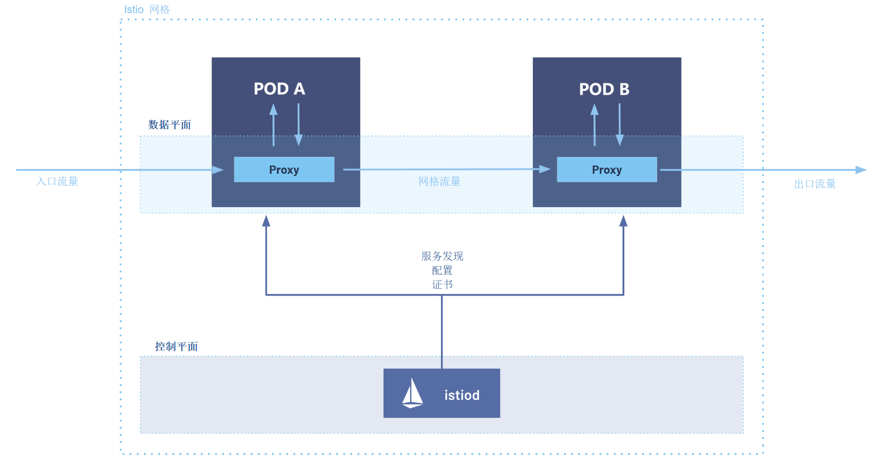
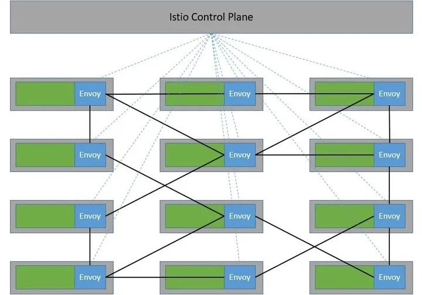
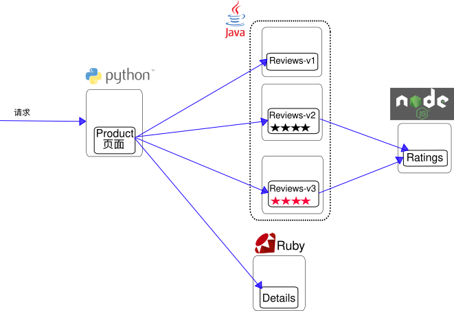
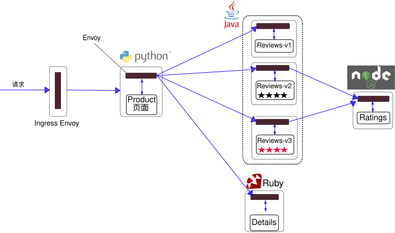
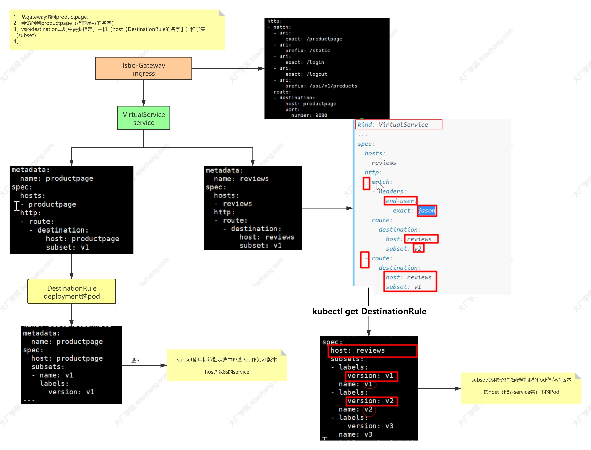

<h1>入门：https://istio.io/latest/zh/docs/setup/getting-started/</h1>


# 架构


Istio 服务网格从逻辑上分为数据平面和控制平面 。

- 数据平面 由一组被部署为 Sidecar 的智能代理（Envoy） 组成。这些代理负责协调和控制微服务之间的所有网络通信。 它们还收集和报告所有网格流量的遥测数据。

- 控制平面 管理并配置代理来进行流量路由。



一个复杂的网络：



简化版：


# 安装

```sh
# https://istio.io/latest/zh/docs/setup/additional-setup/download-istio-release/
curl -L https://istio.io/downloadIstio | ISTIO_VERSION=1.10.0 TARGET_ARCH=x86_64 sh 

cd istio-1.10.0/

export PATH=$PWD/bin:$PATH
```


给命名空间添加标签，指示 Istio 在部署应用的时候，自动注入 Envoy Sidecar 代理：


```sh
kubectl label namespace default istio-injection=enabled
```


# Bookinfo示例应用


### 介绍


>https://istio.io/latest/zh/docs/examples/bookinfo/


未使用 Istio 的 Bookinfo 应用：




要在 Istio 中运行这一样例应用，无需对应用本身做出任何改变。 您只要简单地在启用 Istio 的环境中对这些服务进行配置并运行这些服务， 具体一点说就是把 Envoy Sidecar 注入到每个服务之中。最终的部署结果将如下图所示：




所有的微服务都和 Envoy Sidecar 集成在一起，被集成服务所有的出入流量都被 Sidecar 所劫持， 这样就为外部控制准备了所需的 Hook（钩子），然后就可以利用 Istio 控制平面为整个应用提供服务路由、遥测数据收集以及策略实施等功能。


### 安装Demo

按需安装：https://istio.io/latest/zh/docs/setup/additional-setup/config-profiles/


```sh
# https://istio.io/latest/zh/docs/setup/install/istioctl/
istioctl install --set profile=demo -y

watch kubectl get pod -n istio-system
```


### 运行Bookinfo


部署 Bookinfo 示例应用：

```sh
kubectl apply -f samples/bookinfo/platform/kube/bookinfo.yaml
```


### 把应用关联到Istio网关


每个 Gateway 由类型为 LoadBalancer 的 Service 支撑，该 Service 的外部负载均衡器 IP 和端口用于访问 Gateway。 大多数云平台上运行的集群默认支持类型为 LoadBalancer 的 Kubernetes Service

```sh
kubectl apply -f samples/bookinfo/networking/bookinfo-gateway.yaml
```

```sh
kubectl get svc istio-ingressgateway -n istio-system

NAME                   TYPE           CLUSTER-IP      EXTERNAL-IP   PORT  
istio-ingressgateway   LoadBalancer   10.96.203.157   <pending>     15021:30463/TCP,80:32420/TCP,443:31631/TCP,31400:31902/TCP,15443:30871/TCP
```

在本地内网： http://10.96.203.157/productpage 访问


### 使用 Ingress Gateway 服务的 Node Port访问


https://istio.io/latest/zh/docs/tasks/traffic-management/ingress/ingress-control/#using-node-ports-of-the-ingress-gateway-service


```sh
kubectl get svc -n istio-system
```


```sh
export INGRESS_NAME=istio-ingressgateway

export INGRESS_NS=istio-system
```


```sh
export INGRESS_PORT=$(kubectl -n "${INGRESS_NS}" get service "${INGRESS_NAME}" -o jsonpath='{.spec.ports[?(@.name=="http2")].nodePort}')


export SECURE_INGRESS_PORT=$(kubectl -n "${INGRESS_NS}" get service "${INGRESS_NAME}" -o jsonpath='{.spec.ports[?(@.name=="https")].nodePort}')


export TCP_INGRESS_PORT=$(kubectl -n "${INGRESS_NS}" get service "${INGRESS_NAME}" -o jsonpath='{.spec.ports[?(@.name=="tcp")].nodePort}')
```

```sh
# export INGRESS_HOST=worker-node-address

export INGRESS_HOST=$(kubectl get po -l istio=ingressgateway -n "${INGRESS_NS}" -o jsonpath='{.items[0].status.hostIP}')
```


```sh
[root@k8s-master istio-1.10.0]# env | grep INGRESS_
INGRESS_NAME=istio-ingressgateway
INGRESS_PORT=32420
SECURE_INGRESS_PORT=31631
TCP_INGRESS_PORT=31902
INGRESS_NS=istio-system
INGRESS_HOST=192.168.10.139
```

使用 http://192.168.10.139:32420/productpage 来访问


# 仪表盘【可视化】

```sh
#出错了就再运行一遍
kubectl apply -f samples/addons
```

他会部署这些：grafana   prometheus   jaeger【链路追踪】  kiali【流控】

```sh
kubectl get pod -n istio-system

istio-system           grafana-56d978ff77-6nt8b                     1/1     Running   0          4m26s
istio-system           istio-egressgateway-55d4df6c6b-pp7jf         1/1     Running   0          156m
istio-system           istio-ingressgateway-69dc4765b4-94hbf        1/1     Running   0          156m
istio-system           istiod-798c47d594-tqwvq                      1/1     Running   0          156m
istio-system           jaeger-5c7c5c8d87-7vct5                      1/1     Running   0          4m26s
istio-system           kiali-5bb9c9cf49-w8c76                       1/1     Running   0          4m25s
istio-system           prometheus-8958b965-tn9g4                    2/2     Running   0          4m25s
```

```sh
kubectl get svc -n istio-system 
#可以把kiali和tracing做成NodePort暴露出去查看一下【或者使用ingress暴露出去】
kubectl edit svc -n istio-system kiali
kubectl edit svc -n istio-system tracing

[root@k8s-master kube-prometheus-stack]# kubectl get svc -n istio-system 
NAME                   TYPE           CLUSTER-IP      EXTERNAL-IP   PORT
kiali                  NodePort       10.96.110.116   <none>        20001:31689/TCP,9090:32763/TCP 
tracing                NodePort       10.96.24.228    <none>        80:30001/
```

访问： 
192.168.10.137:31689 
192.168.10.137:30001 


# Istio——概念

https://istio.io/latest/zh/docs/concepts/traffic-management/


图示：（流量进来在gateway给每个请求加的唯一id，就可以追踪了）




# 实战【用istio代替jenkins的ingress】

## 以前ingress写法

```yaml
apiVersion: networking.k8s.io/v1
kind: Ingress
metadata:
  name: itdachang.com
  namespace: default
spec:
  defaultBackend:
    service:
      name: nginx-svc
      port:
        number: 80
  tls:
  - hosts:
    - itdachang.com
    - "*.itdachang.com"
    secretName: itdachang.com
```


```yaml
apiVersion: v1
kind: Service
metadata:
  name: jenkins
  namespace: devops
spec:
  selector:
    app: jenkins
  type: ClusterIP
  ports:
  - name: web
    port: 8080
    targetPort: 8080
    protocol: TCP
  - name: jnlp
    port: 50000
    targetPort: 50000
    protocol: TCP
---
apiVersion: networking.k8s.io/v1
kind: Ingress
metadata:
  name: jenkins
  namespace: devops
spec:
  tls:
  - hosts:
      - jenkins.itdachang.com
    secretName: itdachang.com
  rules:
  - host: jenkins.itdachang.com
    http:
      paths:
      - path: /
        pathType: Prefix
        backend:
          service:
            name: jenkins
            port:
              number: 8080
```


## istio写法

```sh
#为 devops 命名空间开启 Istio 的自动 sidecar 注入功能。这个 sidecar 会拦截进出 Pod 的所有网络流量，从而将 Pod 纳入 Istio 服务网格，享受 mTLS、流量控制、遥测等能力。

#当你希望 devops 命名空间下的微服务（如 Jenkins 或其他应用）享受 Istio 的全套功能（如灰度发布、熔断、可观测性、mTLS 等）时，就需要开启自动注入。
kubectl label namespace devops istio-injection=enabled

kubectl create secret tls itdachang.com --key tls.key --cert tls.crt -n istio-system
```


```yaml
# Gateway: 定义入口点，监听 80 和 443，443 使用通配符证书
apiVersion: networking.istio.io/v1beta1
kind: Gateway
metadata:
  name: itdachang-gateway
  namespace: istio-system
spec:
  selector:
    istio: ingressgateway  # 使用默认的 Ingress Gateway
  servers:
  - port:
      number: 80
      name: http
      protocol: HTTP
    hosts:
    - "*"  # 接收所有 HTTP 请求
  - port:
      number: 443
      name: https
      protocol: HTTPS
    tls:
      mode: SIMPLE
      credentialName: itdachang.com  # 引用包含证书和私钥的 Secret
    hosts:
    - "itdachang.com"
    - "*.itdachang.com"
```

```yaml
# VirtualService: 处理 jenkins.itdachang.com 的流量
apiVersion: networking.istio.io/v1beta1
kind: VirtualService
metadata:
  name: jenkins-vs
  namespace: devops
spec:
  gateways:
  - istio-system/itdachang-gateway  # 引用上面定义的 Gateway
  hosts:
  - "jenkinsx.itdachang.com"
  http:
  - match:
    - uri:
        prefix: /
    route:
    - destination:
        host: jenkins.devops.svc.cluster.local  # 服务全名，端口 8080
        port:
          number: 8080
```

```sh
kubectl get svc -n istio-system istio-ingressgateway

NAME                   TYPE           CLUSTER-IP      EXTERNAL-IP   PORT
istio-ingressgateway   LoadBalancer   10.96.203.157   <pending>     15021:30463/TCP,80:32420/TCP,443:31631/TCP,31400:31902/TCP,15443:30871/TCP 

#改成NodePort
kubectl edit svc -n istio-system istio-ingressgateway

kubectl get svc -n istio-system istio-ingressgateway
NAME                   TYPE       CLUSTER-IP      EXTERNAL-IP   PORT
istio-ingressgateway   NodePort   10.96.203.157   <none>        15021:30463/TCP,80:32420/TCP,443:31631/TCP,31400:31902/TCP,15443:30871/TCP

访问：https://jenkinsx.itdachang.com:31631/ 【hosts: 192.168.10.138 jenkinsx.itdachang.com】
```

## 完整流量路径


1、客户端请求发起

你在本地 hosts 文件中添加了条目：192.168.10.138 jenkinsx.itdachang.com

因此当你访问 `https://jenkinsx.itdachang.com:31631/` 时：

*   **DNS 解析**：域名 `jenkinsx.itdachang.com` 被解析为 IP `192.168.10.138`（你的 Kubernetes 节点 IP）。
    
*   **目标端口**：请求使用 HTTPS 协议，端口 `31631`。
    


2、节点上的 kube-proxy 转发

`istio-ingressgateway` Service 的类型为 **NodePort**，其定义中可以看到：443:31631/TCP

这意味着集群中每个节点的 **31631 端口** 都被映射到 `istio-ingressgateway` Pod 的 **443 端口**（HTTPS）。

当请求到达节点 `192.168.10.138:31631` 时，节点上的 `kube-proxy` 根据 Service 的规则，将流量转发到任意一个健康的 `istio-ingressgateway` Pod 的 **443 端口**。Pod 可能运行在同一个节点或其他节点上，但 kube-proxy 会负责正确转发。


3、Ingress Gateway Pod 处理

`istio-ingressgateway` Pod 中运行的是 **Envoy 代理**，它已经通过 Istio 控制面（Pilot/istiod）接收了 Gateway 和 VirtualService 的配置。

- 3.1 TLS 终止

Gateway 资源中定义了 HTTPS 服务器（端口 443），并指定了 TLS 模式为 `SIMPLE`，证书来自 Secret `itdachang.com`（位于 `istio-system` 命名空间）。Envoy 加载该证书，对传入的 TLS 连接进行解密。

- 3.2 路由匹配

解密后的 HTTP 请求头中 Host 为 `jenkinsx.itdachang.com`。Envoy 查找匹配的 VirtualService：

Gateway 指定了 `istio-system/itdachang-gateway`，所以只考虑挂载了该 Gateway 的 VirtualService。
    
VirtualService `jenkins-vs` 在 `devops` 命名空间，其 `hosts` 列表包含 `jenkinsx.itdachang.com`，匹配成功。
    

- 3.3 路由规则

VirtualService 中定义了对所有路径（`prefix: /`）的流量都路由到后端；Envoy 根据此配置，将请求转发给服务 `jenkins.devops.svc.cluster.local` 的 8080 端口。


4、集群内部服务发现与负载均衡

`jenkins.devops.svc.cluster.local` 是 Kubernetes 内部的一个 Service（假设名为 `jenkins`，位于 `devops` 命名空间）。Envoy 通过 Istio 的服务发现机制获取该 Service 背后的端点列表（即 Jenkins Pod 的 IP）。

Envoy 会将请求负载均衡到其中一个健康的 Jenkins Pod 的 **8080 端口**。


5、最终到达 Jenkins Pod 并响应


Pod 中的 Jenkins 容器监听 8080 端口，接收并处理请求，返回响应。响应数据沿原路返回：Pod → Envoy → 节点端口 → 客户端。


----------

关键点说明

*   **为什么使用 NodePort**：你之前 LoadBalancer 类型处于 `<pending>` 状态，可能是因为环境不支持自动分配外部负载均衡器（如 bare-metal 环境）。改为 NodePort 后，可直接通过节点 IP + 指定端口访问。
    
*   **端口 31631**：这是 istio-ingressgateway Service 中 443 端口映射到节点的固定端口，可以通过 `kubectl get svc -n istio-system istio-ingressgateway` 查看。
    
*   **Gateway 与 VirtualService 分离**：Gateway 负责入口点（监听端口、TLS 配置），VirtualService 负责路由规则（主机匹配、流量分发）。这种分离使得多个团队可以独立管理路由，而集中管理入口安全。
    
*   **证书 Secret 的位置**：`credentialName: itdachang.com` 引用的是 `istio-system` 命名空间中的 Secret，Gateway 所在的命名空间必须与 Secret 相同，因此 Gateway 也放在 `istio-system` 中。
    